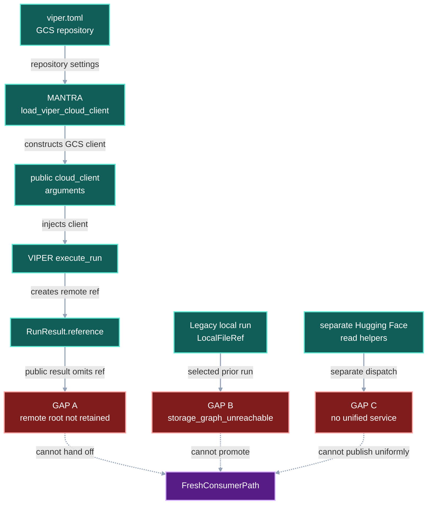
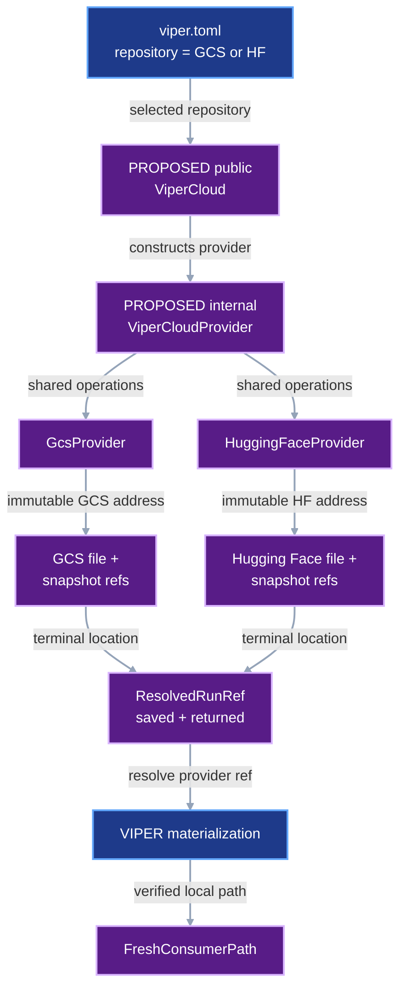
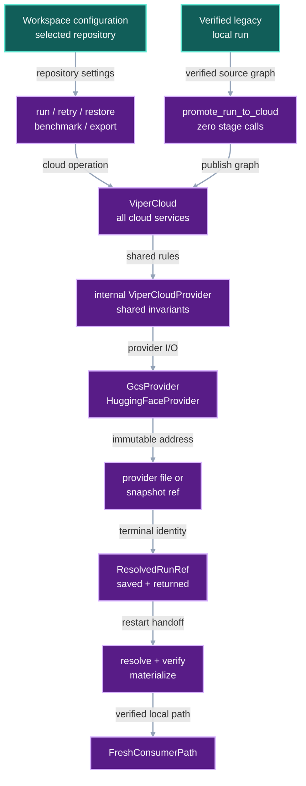

# VIPER Cloud Persistence

## 1. Status

**Contract status:** Draft for guided implementation in this chat. No VIPER
source change is accepted by this document.

| ID | Implementation obligation |
| --- | --- |
| <nobr><code>VC-REQ-01</code></nobr> | A successful cloud run atomically saves and publicly returns its exact cloud-backed `ResolvedRunRef`. |
| <nobr><code>VC-REQ-02</code></nobr> | Restarted code resolves the saved reference and rejects any disagreement with the adjacent terminal `resolved.yaml`. |
| <nobr><code>VC-REQ-03</code></nobr> | An explicit producer-side operation promotes one verified local run graph to ViperCloud without executing a stage. |
| <nobr><code>VC-REQ-04</code></nobr> | Promotion preserves scientific payload bytes, canonical paths, producer relationships, and verified download-rooted lineage while giving rewritten protocol documents new identities. |
| <nobr><code>VC-REQ-05</code></nobr> | Users select a GCS or Hugging Face repository; one public `ViperCloud` service returns that provider's immutable reference while shared provider behavior remains internal. |
| <nobr><code>VC-REQ-06</code></nobr> | VIPER owns cloud resolution and removes application-level clients, duplicated provider logic, and ungrounded trust switches. |
| <nobr><code>VC-REQ-07</code></nobr> | A fresh workspace consumes either provider's cloud-rooted graph through VIPER and receives verified local paths without seeing provider configuration. |

<!-- contract-protocol:generated:start -->
**In progress.** [Jump to current PairBlock](#vc-pb-01)

**Checklist:** [VIPER cloud persistence](../checklists/viper-cloud-persistence.md)

### PairBlocks

<a id="vc-pb-01"></a>

#### <nobr><code>VC-PB-01</code></nobr>

**Status:** drafting

**Requirement contribution:** Persist, return, reload, and verify one cloud-backed terminal run reference.

**Plan:** None

**Current receipt:** None

**Dependencies:** None

**Next action:** Run the current PairBlock plan.

<a id="vc-pb-02"></a>

#### <nobr><code>VC-PB-02</code></nobr>

**Status:** waiting

**Requirement contribution:** Add explicit verified local-to-cloud run-graph promotion without stage execution.

**Plan:** None

**Current receipt:** None

**Dependencies:** <nobr><code>VC-PB-01</code></nobr>

**Next action:** Wait for the declared dependencies.

<a id="vc-pb-03"></a>

#### <nobr><code>VC-PB-03</code></nobr>

**Status:** waiting

**Requirement contribution:** Prove that promotion preserves scientific payload identities, canonical paths, graph meaning, and download-rooted lineage.

**Plan:** None

**Current receipt:** None

**Dependencies:** <nobr><code>VC-PB-02</code></nobr>

**Next action:** Wait for the declared dependencies.

<a id="vc-pb-04"></a>

#### <nobr><code>VC-PB-04</code></nobr>

**Status:** waiting

**Requirement contribution:** Make ViperCloud own both provider services, centralize shared behavior in ViperCloudProvider, and return one immutable reference type per provider.

**Plan:** None

**Current receipt:** None

**Dependencies:** <nobr><code>VC-PB-03</code></nobr>

**Next action:** Wait for the declared dependencies.

<a id="vc-pb-05"></a>

#### <nobr><code>VC-PB-05</code></nobr>

**Status:** waiting

**Requirement contribution:** Remove MANTRA provider plumbing and every superseded cloud-persistence stopgap named by the contract's immediate retirement map.

**Plan:** None

**Current receipt:** None

**Dependencies:** <nobr><code>VC-PB-04</code></nobr>

**Next action:** Wait for the declared dependencies.

<a id="vc-pb-06"></a>

#### <nobr><code>VC-PB-06</code></nobr>

**Status:** waiting

**Requirement contribution:** Prove provider-opaque fresh-workspace consumption through both provider refs and publish the final documentation.

**Plan:** None

**Current receipt:** None

**Dependencies:** <nobr><code>VC-PB-05</code></nobr>

**Next action:** Wait for the declared dependencies.


### Requirements

| Requirement | Claim | Progress | Verifiers | PairBlocks |
|---|---|---|---|---|
| <nobr><code>VC-REQ-01</code></nobr> | A successful run or retry using ViperCloudDestination must atomically save and publicly return the exact cloud-backed ResolvedRunRef created for terminal resolved.yaml. | in_progress | <nobr><code>VC-VR-01</code></nobr> | <nobr><code>VC-PB-01</code></nobr> |
| <nobr><code>VC-REQ-02</code></nobr> | resolve_run_reference must prefer an adjacent saved cloud reference, require GcsFileRef or HuggingFaceFileRef storage, verify that its digest, byte count, and canonical path identify the terminal resolved.yaml, and reject any disagreement without rereading remote payload bytes. | in_progress | <nobr><code>VC-VR-02</code></nobr> | <nobr><code>VC-PB-01</code></nobr> |
| <nobr><code>VC-REQ-03</code></nobr> | An explicit producer-side promotion operation must verify a complete local run graph and return an equivalent cloud-rooted ResolvedRunRef without invoking any stage callable or mutating the source graph. | planned | <nobr><code>VC-VR-03</code></nobr> | <nobr><code>VC-PB-02</code></nobr> |
| <nobr><code>VC-REQ-04</code></nobr> | Promotion must preserve scientific payload digests and byte counts, canonical workspace-relative paths, producer and input relationships, and verified DownloadSpec-rooted lineage; every rewritten protocol document must receive the identity of its new serialized bytes. | planned | <nobr><code>VC-VR-04</code></nobr> | <nobr><code>VC-PB-03</code></nobr> |
| <nobr><code>VC-REQ-05</code></nobr> | Workspace configuration must let a user select one GCS or Hugging Face repository; the public ViperCloud facade must own publication, sealing, copying, fetching, verification, and materialization and return that repository's provider-specific immutable file and snapshot refs; an internal ViperCloudProvider base class must implement shared manifest, identity, retry, and atomic-materialization behavior while provider subclasses implement only repository-specific I/O. | planned | <nobr><code>VC-VR-05</code></nobr> | <nobr><code>VC-PB-04</code></nobr> |
| <nobr><code>VC-REQ-06</code></nobr> | Public run, retry, restore, benchmark, and export operations must resolve ViperCloud internally, and the migration must remove MANTRA's provider loader, every application-level cloud_client injection, GCS-owned shared manifest logic, direct Hugging Face fetch dispatch outside ViperCloud, and blanket execution trust switches that are not derived from an immutable reference or verification receipt. | planned | <nobr><code>VC-VR-06</code></nobr> | <nobr><code>VC-PB-05</code></nobr> |
| <nobr><code>VC-REQ-07</code></nobr> | For both GCS and Hugging Face repositories, a fresh workspace with no producer path and an empty verified-object cache must consume the cloud-rooted graph through existing VIPER authoring, verification, and materialization boundaries while stage and consumer code receive only resolved references and verified local paths. | planned | <nobr><code>VC-VR-07</code></nobr> | <nobr><code>VC-PB-06</code></nobr> |

### Verification rules

| Rule | Requirements | Acceptance conditions | Success case | Rejection cases |
|---|---|---|---|---|
| <nobr><code>VC-VR-01</code></nobr> | <nobr><code>VC-REQ-01</code></nobr> | Cloud run and retry success records expose the same ResolvedRunRef returned by execution and save the same serialized reference beside terminal resolved.yaml; a different existing sidecar is rejected with RunError('terminal cloud reference differs'). | [test_cloud_run_persists_and_returns_terminal_reference](../../viper/tests/test_run_execution.py) | [test_cloud_run_rejects_mismatched_terminal_reference](../../viper/tests/test_run_execution.py) |
| <nobr><code>VC-VR-02</code></nobr> | <nobr><code>VC-REQ-02</code></nobr> | Restart resolution loads a matching adjacent cloud sidecar without network I/O and rejects a non-cloud location or terminal identity mismatch with RestoreError('stored run reference differs from terminal identity'). | [test_resolve_run_reference_prefers_verified_cloud_sidecar](../../viper/tests/test_storage.py) | [test_resolve_run_reference_rejects_mismatched_cloud_sidecar](../../viper/tests/test_storage.py) |
| <nobr><code>VC-VR-03</code></nobr> | <nobr><code>VC-REQ-03</code></nobr> | Promotion verifies and publishes the reachable local graph, returns a cloud-rooted ResolvedRunRef, leaves source bytes unchanged, and records zero stage calls; missing or changed source bytes raise RunPromotionError('source run graph is unavailable'). | [test_promotes_verified_local_run_without_stage_execution](../../viper/tests/test_cloud_execution.py) | [test_promotion_rejects_missing_or_changed_source_bytes](../../viper/tests/test_cloud_execution.py) |
| <nobr><code>VC-VR-04</code></nobr> | <nobr><code>VC-REQ-04</code></nobr> | The promoted graph retains every scientific payload identity, canonical path, producer and input relationship, and required DownloadSpec root while rewritten protocol records match their new bytes; an unverified or unrooted source graph is rejected before publication. | [test_promotion_preserves_payloads_paths_and_download_lineage](../../viper/tests/test_cloud_execution.py) | [test_promotion_rejects_unverified_or_unrooted_source_graph](../../viper/tests/test_cloud_execution.py) |
| <nobr><code>VC-VR-05</code></nobr> | <nobr><code>VC-REQ-05</code></nobr> | The same ViperCloud operations publish and restore through a configured GCS repository and a configured Hugging Face repository, returning that repository's file and snapshot refs; both providers inherit shared invariants from ViperCloudProvider; an unsupported provider or invalid repository fails before publication. | [test_viper_cloud_dispatches_by_configured_repository_ref](../../viper/tests/test_cloud_service.py) | [test_viper_cloud_rejects_unknown_or_invalid_repository](../../viper/tests/test_cloud_service.py) |
| <nobr><code>VC-VR-06</code></nobr> | <nobr><code>VC-REQ-06</code></nobr> | VIPER's public operations expose no cloud_client parameter; all provider dispatch and shared manifest behavior live behind ViperCloud; MANTRA rebuild modules contain no provider construction or injection; execution trust follows an immutable reference or receipt rather than a caller-selected Boolean. | [test_public_cloud_operations_use_viper_cloud_service](../../viper/tests/test_public_api.py) | [test_rebuild_rejects_provider_coupling](../../MANTRA/src/mantra/rebuild/tests/test_cloud_boundary.py) |
| <nobr><code>VC-VR-07</code></nobr> | <nobr><code>VC-REQ-07</code></nobr> | For each configured provider, a consumer in a fresh workspace freezes and executes against the promoted cloud root, receives verified local paths, and creates no duplicate immutable payload beneath .viper/store. | [test_fresh_workspace_consumes_each_provider_ref](../../viper/tests/test_cloud_execution.py) | [test_cloud_pointer_rejects_a_local_producer](../../viper/tests/test_prior_run_inputs.py) |
<!-- contract-protocol:generated:end -->

## 2. Claim

When a run uses `ViperCloudDestination`, VIPER publishes its immutable payloads
once, saves one durable provider-specific reference to the remote terminal run,
and later returns verified bytes or verified local paths without exposing the
provider implementation to the consumer.

The workspace selects a GCS or Hugging Face repository. The public
`ViperCloud` service owns publication, sealing, copying, fetching, verification,
and materialization. It returns `GcsFileRef` for GCS and
`HuggingFaceFileRef` for Hugging Face. An internal `ViperCloudProvider` base
class owns the behavior shared by both repositories; provider subclasses own
only repository-specific I/O.

A legacy local run may cross that boundary only through an explicit,
fully verified promotion. Promotion never executes a stage and never mutates
the original graph.

## Current gap

### Evidence state

| State | Evidence |
| --- | --- |
| **Declared** | The workspace path remains the canonical path locally and in ViperCloud; a sealed manifest binds that path to exact bytes. |
| **Inspected** | [`execute_run()`](../../viper/src/viper/execution/_attempt.py) creates the correct cloud-backed `RunResult.reference`. |
| **Inspected** | [`RunSuccess`](../../viper/src/viper/api.py) and `RetrySuccess` omit that reference. |
| **Inspected** | [`_freeze_input()`](../../viper/src/viper/authoring.py) rejects a cloud plan whose selected producer is rooted at `LocalFileRef`. |
| **Inspected** | VIPER's public `run`, `retry`, `restore`, `benchmark`, and `export_run` operations accept an optional `cloud_client`, so applications can select and construct storage providers. |
| **Inspected** | [`src/mantra/rebuild/viper_cloud.py`](../../MANTRA/src/mantra/rebuild/viper_cloud.py) parses workspace configuration, constructs `GcsViperCloudClient`, and injects it into five MANTRA modules at ten call sites. |
| **Inspected** | GCS owns shared revision-manifest behavior in [`src/viper/gcs.py`](../../viper/src/viper/gcs.py), while Hugging Face has direct read/list dispatch in [`src/viper/_verification/storage.py`](../../viper/src/viper/_verification/storage.py) rather than the same publication service. |
| **Verified** | `test_cloud_publication_is_atomic_and_retryable` and `test_attempt_publishes_evidence_to_selected_destination` pass against VIPER commit `cea4c1a0fe0aefe9cb9ccbb3e708685aa28a139a`. |
| **Verified** | `test_cloud_pointer_rejects_a_local_producer` proves the current legacy-local rejection. |
| **Proposed** | Durable run-reference persistence and local-graph promotion do not exist yet. |

### Gap analysis

The claim has two current entry paths, so each path stops at its own first
unsupported connector.

**Cloud run path.** `publish_resolved_files()` seals terminal `resolved.yaml`
and `execute_run()` constructs a correct cloud-backed `ResolvedRunRef`.
`run_request()` then constructs `RunSuccess` without that field. The first
unsupported connector is:

```text
RunResult.reference -> RunSuccess.reference
```

After the process exits, the workspace retains child cloud references but no
canonical serialized root pointer to the remote terminal document.

**Legacy local path.** A `ResolvedRunRef` rooted at `LocalFileRef` reaches
`_freeze_input()` for a cloud-destination consumer. The function raises
`ValueError("storage_graph_unreachable")`. The first unsupported connector is:

```text
verified local ResolvedRunRef -> cloud-rooted ResolvedRunRef
```

That rejection is correct until a producer-side promotion verifies and
publishes the complete reachable graph. Silently uploading during
`_freeze_input()` would hide a durable mutation inside plan authoring and would
still fail when the producer's local store is absent.

**Provider path.** The workspace repository choice currently enters MANTRA's
`load_viper_cloud_client()`, which constructs a GCS client and passes it through
VIPER's public execution calls. Hugging Face reads take a different path. The
first unsupported connector is:

```text
workspace repository choice -> one VIPER-owned ViperCloud service
```

The application therefore knows the provider, shared storage behavior is split
across provider modules, and adding another provider requires changes above the
storage boundary.

**Counterexamples.** A cloud run completes, its process exits, and another
process has only the local terminal path; the exact remote root is not directly
loadable from a retained pointer. Separately, a valid legacy run exists on its
producer machine, but a cloud consumer cannot receive an equivalent cloud root
without rerunning or manually copying its graph.

**Disposition:** gap confirmed. Preserve direct cloud publication and the
local-producer rejection. Add a durable root pointer, one explicit verified
promotion operation, and one VIPER-owned service with provider-specific refs
over a shared internal provider implementation.

### Change-impact analysis

The fixed scenario uses `artifacts/train/model.bin` with bytes
`b"parameters"`. The intended result in every graph is:

```text
FreshConsumerPath = verified local materialization of the same model bytes
```

#### Current DAG



#### Proposed-change DAG



#### Integrated DAG



The proposed change strengthens **delivery** and **execution** guarantees. It
does not by itself establish scientific or semantic correctness; existing
domain verifiers remain responsible for those claims.

| Surface | Current | Accepted change | Disposition |
| --- | --- | --- | --- |
| `RunResult.reference` | Correct cloud root exists in memory | Persist and expose the same value | Change |
| `RunSuccess`, `RetrySuccess` | Return local paths only | Add `reference: ResolvedRunRef` | Change |
| `resolved.ref.yaml` | Absent | Serialize the exact `ResolvedRunRef` beside terminal `resolved.yaml` | PlannedAddition |
| `resolve_run_reference()` | A terminal path becomes a `LocalFileRef` | Prefer and verify adjacent `resolved.ref.yaml`; retain local fallback when absent | Change |
| `_freeze_input()` local/cloud rejection | Rejects `LocalFileRef` for a cloud consumer | Keep the rejection; require explicit promotion first | Retain |
| `promote_run_to_cloud()` | Absent | Verify, transform, publish, and return one cloud root without stage execution | PlannedAddition |
| Scientific payload identity | Exact SHA-256 and byte count | Unchanged | Retain |
| Rewritten protocol-document identity | Local references are part of serialized bytes | Recompute after replacing storage references | Change |
| Provider refs | One provider-neutral `ViperCloudFileRef`; existing `HuggingFaceFileRef` is read separately | `GcsFileRef` and `HuggingFaceFileRef`; a union type may name their shared use | Change |
| Public service | Applications construct and inject `ViperCloudClient` | `ViperCloud` resolves configuration and owns all cloud operations | Change |
| Provider extension | GCS owns shared manifest logic; Hugging Face uses separate read helpers | Internal `ViperCloudProvider` base owns shared behavior; subclasses own repository I/O | Change |
| Public execution calls | Accept optional `cloud_client` | Resolve `ViperCloud` internally; remove the argument | Change |
| Execution trust | Caller can enable blanket `trust_immutable_payloads` | Trust follows an immutable provider ref or verification receipt | Change |
| `.viper/store` in cloud mode | No duplicate immutable payload | Keep absent | Retain |

**Verdict:** implement. The design retains the publisher, fetcher, verifier,
canonical paths, provider I/O, and content identities. It replaces public
provider injection with one service, adds provider-specific refs and one shared
internal provider base, and adds one pointer document plus one explicit graph
transformation.

## 3. Models

| Model or field | Exact role |
| --- | --- |
| `GcsRepository(bucket, prefix)` | Proposed GCS repository selection parsed from `[viper_cloud]`; credentials remain environment-owned. |
| `HuggingFaceRepository(repository, repo_type)` | Proposed Hugging Face repository selection parsed from `[viper_cloud]`; credentials remain environment-owned. |
| `ViperCloudRepository` | Proposed discriminated union of the two repository settings; adding a provider adds one member without changing consumers. |
| `GcsFileRef(bucket, prefix, owner, workspace, revision, path)` | Proposed immutable GCS file address returned by `ViperCloud`. |
| `GcsStageResultSnapshotRef(bucket, prefix, owner, workspace, revision)` | Proposed immutable GCS stage-snapshot address returned by `ViperCloud`. |
| `HuggingFaceFileRef(repo_id, revision, path, repo_type)` | Existing immutable Hugging Face address, used through `ViperCloud`. |
| `HuggingFaceStageResultSnapshotRef(repository, commit, repo_type)` | Existing immutable Hugging Face stage-snapshot address, used through `ViperCloud`. |
| `CloudFileRef`, `CloudStageResultSnapshotRef` | Proposed union aliases over the provider refs; they add no runtime object or provider behavior. |
| `ViperCloud` | Proposed public service that resolves the configured repository and performs every cloud operation. |
| `ViperCloudProvider` | Proposed internal base implementation for canonical manifests, identity checks, retry behavior, sealing, and atomic materialization. |
| `GcsProvider`, `HuggingFaceProvider` | Proposed internal subclasses that implement only repository-specific I/O. |
| `ResolvedRunRef(sha256, bytes, stored_at)` | Existing content identity plus terminal location; unchanged. |
| `RunSuccess.reference: ResolvedRunRef` | Proposed public return of the successful run's exact root. |
| `RetrySuccess.reference: ResolvedRunRef` | Proposed public return of the retry's exact root. |
| `resolved.ref.yaml` | Proposed serialization of one `ResolvedRunRef`; adjacent to terminal `resolved.yaml`; contains no artifact bytes. |
| `promote_run_to_cloud(root, source, destination)` | Proposed explicit operation returning a cloud-rooted `ResolvedRunRef`; VIPER resolves `ViperCloud` internally. |

`resolved.ref.yaml` is a control pointer, not another scientific artifact. It
does not create an infinite remote-reference requirement.

`ViperCloudProvider` is an extension seam inside VIPER. Users do not construct
it, select a subclass, or pass it to stages. They select a repository in
`viper.toml`; `ViperCloud` constructs the provider and returns immutable refs.

## 4. Execution

1. Workspace configuration selects one GCS or Hugging Face repository.
2. A public VIPER operation resolves `ViperCloud`; the service selects its
   internal provider and publishes through that repository without exposing the
   provider to application code.
3. The provider returns `GcsFileRef` or `HuggingFaceFileRef`, and
   `execute_run()` constructs `RunResult.reference` from that immutable address.
4. VIPER serializes that exact value to adjacent `resolved.ref.yaml`, then
   returns it through `RunSuccess.reference` or `RetrySuccess.reference`.
5. After restart, `resolve_run_reference()` loads the sidecar and checks that
   its digest, byte count, and canonical path identify adjacent `resolved.yaml`.
   It does not reread the remote payload; the existing materialization boundary
   verifies remote bytes when a consumer actually requests them.
6. For a legacy local run, the producer explicitly calls
   `promote_run_to_cloud()` while its local store is available.
7. Promotion verifies the source graph, walks it bottom-up, publishes unchanged
   scientific payloads, rewrites storage references in protocol documents,
   recomputes those document identities, and seals the cloud graph.
8. A fresh consumer uses the cloud-rooted `ResolvedRunRef`; existing authoring,
   verification, and materialization return a verified local path.

## 5. Persisted evidence

| Record | Exact evidence |
| --- | --- |
| Terminal `resolved.yaml` | Existing terminal status and child-reference graph. |
| Adjacent `resolved.ref.yaml` | Exact remote root for the terminal bytes. |
| Provider manifest | Provider-neutral path, digest, and byte count for each sealed revision, encoded by the shared base and persisted through the selected repository. |
| Promoted terminal graph | New protocol-document identities and preserved semantic producer/input relationships. |
| Existing download-source closure receipts | Proof that required raw-data branches terminate at verified `DownloadSpec` stages. |
| Focused gate receipts | Source, type, test, documentation, and lint results for each PairBlock. |

## 6. Verification

| Rule | Executable condition |
| --- | --- |
| <nobr><code>VC-VR-01</code></nobr> | `tests/test_run_execution.py::test_cloud_run_persists_and_returns_terminal_reference` proves the saved and returned references equal `RunResult.reference`; `test_cloud_run_rejects_mismatched_terminal_reference` rejects a different digest, byte count, location, or path with `RunError("terminal cloud reference differs")`. |
| <nobr><code>VC-VR-02</code></nobr> | `tests/test_storage.py::test_resolve_run_reference_prefers_verified_cloud_sidecar` proves restart recovery without cloud I/O; `test_resolve_run_reference_rejects_mismatched_cloud_sidecar` rejects a non-cloud location or terminal disagreement with `RestoreError("stored run reference differs from terminal identity")`. |
| <nobr><code>VC-VR-03</code></nobr> | `tests/test_cloud_execution.py::test_promotes_verified_local_run_without_stage_execution` proves explicit promotion and zero stage calls; `test_promotion_rejects_missing_or_changed_source_bytes` rejects with `RunPromotionError("source run graph is unavailable")`. |
| <nobr><code>VC-VR-04</code></nobr> | `tests/test_cloud_execution.py::test_promotion_preserves_payloads_paths_and_download_lineage` compares payload identities, canonical paths, producer edges, and download roots; `test_promotion_rejects_unverified_or_unrooted_source_graph` rejects before publication. |
| <nobr><code>VC-VR-05</code></nobr> | `tests/test_cloud_service.py::test_viper_cloud_dispatches_by_configured_repository_ref` publishes and restores through GCS and Hugging Face using the same service and returns the matching ref type; `test_viper_cloud_rejects_unknown_or_invalid_repository` rejects before publication. |
| <nobr><code>VC-VR-06</code></nobr> | `tests/test_public_api.py::test_public_cloud_operations_use_viper_cloud_service` proves the public API has no `cloud_client` argument and derives trust from refs or receipts; MANTRA's `test_rebuild_rejects_provider_coupling` rejects provider construction or injection. |
| <nobr><code>VC-VR-07</code></nobr> | `tests/test_cloud_execution.py::test_fresh_workspace_consumes_each_provider_ref` restores and consumes from an empty workspace through each provider; `test_cloud_pointer_rejects_a_local_producer` retains the local-root rejection. |

## 7. Propagation

| Surface | Required change |
| --- | --- |
| [`src/viper/api.py`](../../viper/src/viper/api.py) | Add `reference` to public run and retry success models and handlers. |
| [`src/viper/execution/_attempt.py`](../../viper/src/viper/execution/_attempt.py) | Persist the exact successful terminal reference after publication. |
| [`src/viper/execution/_restore.py`](../../viper/src/viper/execution/_restore.py) | Load and verify the adjacent cloud reference before local fallback. |
| `src/viper/execution/_promotion.py` | Add the bounded verified local-to-cloud graph transformation. |
| [`src/viper/execution/__init__.py`](../../viper/src/viper/execution/__init__.py) | Export the promotion operation without exposing provider internals. |
| `src/viper/execution/errors.py` | Add `RunPromotionError` for promotion-boundary failures. |
| [`src/viper/references.py`](../../viper/src/viper/references.py) | Replace provider-neutral cloud file and snapshot refs with GCS-specific refs; retain the Hugging Face refs; define unions only for shared typing. |
| [`src/viper/storage.py`](../../viper/src/viper/storage.py) | Own the public `ViperCloud` service and internal `ViperCloudProvider` common implementation. |
| [`src/viper/gcs.py`](../../viper/src/viper/gcs.py) | Retain only GCS-specific object I/O behind `GcsProvider`. |
| `src/viper/huggingface.py` | Add Hugging Face publication and object I/O behind `HuggingFaceProvider`. |
| [`src/viper/_verification/storage.py`](../../viper/src/viper/_verification/storage.py) | Delegate provider reads to `ViperCloud`; retain verification and cache policy. |
| Public execution modules | Resolve `ViperCloud` from workspace configuration and remove public `cloud_client` parameters. |
| [`src/viper/authoring.py`](../../viper/src/viper/authoring.py) | Retain `storage_graph_unreachable` for an unpromoted local producer in a cloud plan. |
| MANTRA rebuild modules | Delete provider construction and remove all explicit cloud-client injection. |
| Tests and public documentation | Add both providers, the rejection boundaries, and the run, retry, restore, promotion, and cloud-path guidance. |

## 8. Retirement map

### Remove with the ViperCloud migration

- Delete `MANTRA/src/mantra/rebuild/viper_cloud.py` and its dedicated test.
- Remove the ten `cloud_client=` production injections from
  `hopfield_input_rebuild.py`, `hopfield_replay.py`, `mil_reconstruction.py`,
  `mil_replay.py`, and `viper_restore.py`.
- Remove the Hopfield test monkeypatch for `load_viper_cloud_client`.
- Remove `cloud_client` parameters from VIPER's public `run`, `retry`,
  `restore`, `benchmark`, and `export_run` operations.
- Replace provider-neutral `ViperCloudFileRef` and
  `ViperCloudStageResultSnapshotRef` with GCS-specific refs; route them and the
  existing Hugging Face file and snapshot refs through `ViperCloud`.
- Move canonical manifest, sealing, retry, identity, and atomic-materialization
  behavior out of the GCS adapter into the shared provider implementation.
- Move direct Hugging Face fetch/list dispatch behind `ViperCloud`.
- Replace blanket caller-selected `trust_immutable_payloads=True` behavior with
  trust derived from an immutable provider ref or retained verification receipt.

### Remove after the source-derived baseline passes

These removals remain owned by the Hopfield and MIL reconstruction contracts;
`VC-PB-05` does not remove them before their replacement baseline passes.

- Delete `copy_versioned_input()`; it copies cached bytes and is not a source
  build.
- Retire the cached restoration-run input path in `viper_restore.py`.
- Retire `RestorationBinding` machinery used only for historical disk imports.
- Remove Hopfield and MIL entrypoints that require a restoration run instead of
  source-derived inputs.

### Retain

- Streaming restore and verified-object caching.
- Immutable publication, sealing, content digests, and canonical paths.
- The local store for local-mode workspaces; cloud mode does not duplicate its
  immutable payloads there.
- `storage_graph_unreachable` for a genuinely unpromoted local graph.

## 9. Acceptance case

### Success

The acceptance runs once with a configured GCS repository and once with a
configured Hugging Face repository. A producer with an available verified local
run calls `promote_run_to_cloud()`. No stage callable runs. VIPER returns a
cloud-rooted `ResolvedRunRef` containing the matching provider ref and saves it
beside the local terminal document. A fresh workspace with no producer path and
an empty verified-object cache uses that reference to freeze and execute a
consumer. The consumer receives the original `model.bin` bytes at its declared
input path and never receives a bucket, URI, repository identifier, provider
object, or cache selector.

### Rejection

Promotion stops before publication when a required source byte sequence is
missing, changed, or fails the existing run verifier. Restart resolution stops
when `resolved.ref.yaml` disagrees with adjacent terminal bytes. A cloud plan
still rejects an unpromoted `LocalFileRef` with
`ValueError("storage_graph_unreachable")`.

## 10. Implementation order

1. <nobr><code>VC-PB-01</code></nobr>: durable cloud run reference.
2. <nobr><code>VC-PB-02</code></nobr>: verified explicit graph promotion.
3. <nobr><code>VC-PB-03</code></nobr>: lineage and identity acceptance.
4. <nobr><code>VC-PB-04</code></nobr>: provider refs, public `ViperCloud`, and the shared internal provider implementation.
5. <nobr><code>VC-PB-05</code></nobr>: remove provider plumbing and superseded stopgaps from MANTRA and VIPER.
6. <nobr><code>VC-PB-06</code></nobr>: GCS and Hugging Face fresh-workspace acceptance and documentation.

We will implement these in guided mode in this chat. Each PairBlock gets one
complete bounded edit, its focused check, Pyright, affected tests,
documentation checks, and final non-mutating Ruff checks before the next block.

## 11. Master checklist

The [VIPER cloud persistence checklist](../checklists/viper-cloud-persistence.md)
places each requirement once. It contains no competing design prose.

## 12. Contract-owned PairBlocks

| PairBlock | Requirements | Focused result |
| --- | --- | --- |
| <nobr><code>VC-PB-01</code></nobr> | <nobr><code>VC-REQ-01</code></nobr>, <nobr><code>VC-REQ-02</code></nobr> | A cloud run saves, returns, reloads, and verifies one exact terminal reference. |
| <nobr><code>VC-PB-02</code></nobr> | <nobr><code>VC-REQ-03</code></nobr> | Explicit promotion returns a cloud root without stage execution. |
| <nobr><code>VC-PB-03</code></nobr> | <nobr><code>VC-REQ-04</code></nobr> | Promotion preserves payload identities, paths, graph meaning, and download roots. |
| <nobr><code>VC-PB-04</code></nobr> | <nobr><code>VC-REQ-05</code></nobr> | `ViperCloud` serves both repositories through provider-specific refs and one shared internal implementation. |
| <nobr><code>VC-PB-05</code></nobr> | <nobr><code>VC-REQ-06</code></nobr> | MANTRA and VIPER no longer expose or inject provider clients or retain the named stopgaps. |
| <nobr><code>VC-PB-06</code></nobr> | <nobr><code>VC-REQ-07</code></nobr> | Fresh workspaces consume both provider refs through the same public service. |

## 13. ContractTarget

The current guided PairBlock will receive a candidate-bound `PairBlockPlan`
only after its complete source, test, documentation, and gate targets are known.
Every proposed path begins as `PlannedAddition`; the candidate's added paths
must equal that set. VIPER owns the service and providers. MANTRA changes are
limited to removing application-owned provider plumbing and the explicitly
listed post-acceptance reconstruction stopgaps. RICO owns only this contract,
checklist, plans, and evidence.

## Sources

- VIPER commit `cea4c1a0fe0aefe9cb9ccbb3e708685aa28a139a`.
- MANTRA commit `6bedf04247d76738ff57ff51153166bde9757c10`.
- [`docs/reference/protocol.md`](../../viper/docs/reference/protocol.md),
  workspace and cloud path contract.
- [`src/viper/storage.py`](../../viper/src/viper/storage.py), current
  publication and `ViperCloudClient` boundary.
- [`src/viper/execution/_source.py`](../../viper/src/viper/execution/_source.py),
  current verified materialization boundary.
