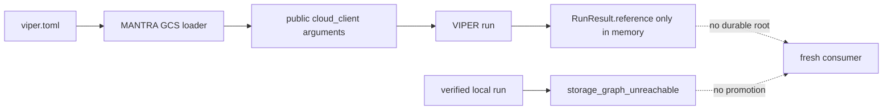
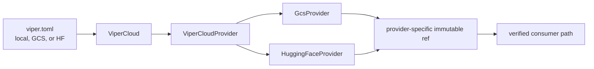
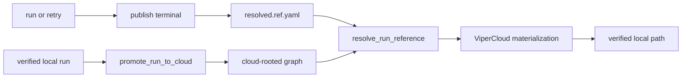

# VIPER Cloud Persistence

## 1. Status

**Implementation status:** complete on the isolated candidate branches below.

**Contract lifecycle status:** implementation evidence is retained, but formal
PairBlock plan and lifecycle receipts have not been minted. The generated
section therefore remains at `drafting`/`waiting`; it does not override the
verified implementation result.

| Repository | Branch | Accepted commit |
| --- | --- | --- |
| VIPER | `codex/viper-cloud-persistence` | `cbe801c239bd78b1d1e3c11cea4f57bc81b8a6f4` |
| MANTRA | `codex/viper-cloud-boundary` | `e9443c0bb0728e1285a864f47aa53fd88304cbc8` |

<!-- contract-protocol:generated:start -->
**In progress.** [Jump to current PairBlock](#vc-pb-01)

**Checklist:** [VIPER cloud persistence](../checklists/viper-cloud-persistence.md)

### PairBlocks

#### <nobr><code>VC-PB-01</code></nobr>

**Status:** drafting

**Requirement contribution:** Persist, return, reload, and verify one cloud-backed terminal run reference.

**Plan:** None

**Current receipt:** None

**Dependencies:** None

**Next action:** Register the already-verified candidate implementation.

#### <nobr><code>VC-PB-02</code></nobr>

**Status:** waiting

**Requirement contribution:** Add explicit verified local-to-cloud run-graph promotion without stage execution.

**Plan:** None

**Current receipt:** None

**Dependencies:** <nobr><code>VC-PB-01</code></nobr>

**Next action:** Register after <nobr><code>VC-PB-01</code></nobr>.

#### <nobr><code>VC-PB-03</code></nobr>

**Status:** waiting

**Requirement contribution:** Prove that promotion preserves scientific payload identities, canonical paths, graph meaning, and download-rooted lineage already present in the source graph.

**Plan:** None

**Current receipt:** None

**Dependencies:** <nobr><code>VC-PB-02</code></nobr>

**Next action:** Register after <nobr><code>VC-PB-02</code></nobr>.

#### <nobr><code>VC-PB-04</code></nobr>

**Status:** waiting

**Requirement contribution:** Make ViperCloud own both provider services, centralize shared behavior in ViperCloudProvider, and return one immutable reference type per provider.

**Plan:** None

**Current receipt:** None

**Dependencies:** <nobr><code>VC-PB-03</code></nobr>

**Next action:** Register after <nobr><code>VC-PB-03</code></nobr>.

#### <nobr><code>VC-PB-05</code></nobr>

**Status:** waiting

**Requirement contribution:** Remove MANTRA provider plumbing and every superseded cloud-persistence stopgap named by the immediate retirement map.

**Plan:** None

**Current receipt:** None

**Dependencies:** <nobr><code>VC-PB-04</code></nobr>

**Next action:** Register after <nobr><code>VC-PB-04</code></nobr>.

#### <nobr><code>VC-PB-06</code></nobr>

**Status:** waiting

**Requirement contribution:** Prove provider-opaque fresh-workspace materialization through both provider refs and publish the final documentation.

**Plan:** None

**Current receipt:** None

**Dependencies:** <nobr><code>VC-PB-05</code></nobr>

**Next action:** Register after <nobr><code>VC-PB-05</code></nobr>.

### Requirements

| Requirement | Claim | Progress | Verifiers | PairBlocks |
|---|---|---|---|---|
| <nobr><code>VC-REQ-01</code></nobr> | A successful run or retry using `ViperCloudDestination` atomically saves and publicly returns the exact cloud-backed `ResolvedRunRef` created for terminal `resolved.yaml`. | in_progress | <nobr><code>VC-VR-01</code></nobr> | <nobr><code>VC-PB-01</code></nobr> |
| <nobr><code>VC-REQ-02</code></nobr> | `resolve_run_reference` prefers an adjacent saved cloud reference, verifies the local terminal identity, and rejects disagreement without rereading remote payload bytes. | in_progress | <nobr><code>VC-VR-02</code></nobr> | <nobr><code>VC-PB-01</code></nobr> |
| <nobr><code>VC-REQ-03</code></nobr> | Explicit promotion verifies a complete local run graph and returns an equivalent cloud-rooted `ResolvedRunRef` without invoking a stage or mutating the source graph. | planned | <nobr><code>VC-VR-03</code></nobr> | <nobr><code>VC-PB-02</code></nobr> |
| <nobr><code>VC-REQ-04</code></nobr> | Promotion preserves scientific payload identities, paths, graph relationships, and verified download-rooted lineage already present in the source while assigning rewritten protocol bytes their new identities. | planned | <nobr><code>VC-VR-04</code></nobr> | <nobr><code>VC-PB-03</code></nobr> |
| <nobr><code>VC-REQ-05</code></nobr> | Workspace configuration selects GCS or Hugging Face while `ViperCloud` owns provider dispatch and the shared provider base owns common publication and verification behavior. | planned | <nobr><code>VC-VR-05</code></nobr> | <nobr><code>VC-PB-04</code></nobr> |
| <nobr><code>VC-REQ-06</code></nobr> | Public execution operations and MANTRA application code expose no provider client injection. | planned | <nobr><code>VC-VR-06</code></nobr> | <nobr><code>VC-PB-05</code></nobr> |
| <nobr><code>VC-REQ-07</code></nobr> | A fresh workspace materializes either provider's immutable reference to a verified local path without creating a duplicate immutable local store. | planned | <nobr><code>VC-VR-07</code></nobr> | <nobr><code>VC-PB-06</code></nobr> |

### Verification rules

| Rule | Requirements | Success case | Rejection case |
|---|---|---|---|
| <nobr><code>VC-VR-01</code></nobr> | <nobr><code>VC-REQ-01</code></nobr> | `test_cloud_native_run_returns_and_persists_one_terminal_reference`; `test_cloud_native_retry_replaces_the_verified_terminal_reference` | `test_terminal_reference_rejects_an_unverified_replacement` |
| <nobr><code>VC-VR-02</code></nobr> | <nobr><code>VC-REQ-02</code></nobr> | `test_resolve_run_reference_prefers_adjacent_cloud_pointer` | `test_resolve_run_reference_rejects_stale_cloud_pointer` |
| <nobr><code>VC-VR-03</code></nobr> | <nobr><code>VC-REQ-03</code></nobr> | `test_explicit_cloud_promotion_preserves_local_run_mode` | `test_explicit_cloud_promotion_rejects_missing_source_bytes` |
| <nobr><code>VC-VR-04</code></nobr> | <nobr><code>VC-REQ-04</code></nobr> | `test_explicit_cloud_promotion_preserves_local_run_mode` | `test_explicit_cloud_promotion_rejects_missing_source_bytes` |
| <nobr><code>VC-VR-05</code></nobr> | <nobr><code>VC-REQ-05</code></nobr> | `test_fresh_workspace_materializes_each_provider_reference`; `test_hugging_face_repository_publishes_one_self_describing_reference`; `test_cloud_publication_is_atomic_and_retryable` | `test_storage_settings_parse_local_and_cloud_destinations` |
| <nobr><code>VC-VR-06</code></nobr> | <nobr><code>VC-REQ-06</code></nobr> | `test_public_execution_signatures_do_not_expose_provider_clients` | `test_rebuild_rejects_provider_coupling` |
| <nobr><code>VC-VR-07</code></nobr> | <nobr><code>VC-REQ-07</code></nobr> | `test_fresh_workspace_materializes_each_provider_reference` | `test_cloud_pointer_rejects_a_local_producer` |
<!-- contract-protocol:generated:end -->

## 2. Claim

Cloud storage is optional. A local workspace continues to use the local
immutable store. When a workspace selects a remote repository, `ViperCloud`
publishes and retrieves immutable artifacts without exposing GCS or Hugging
Face objects to stages or application code.

Every cloud-native terminal run returns a `ResolvedRunRef` and writes the same
reference to adjacent `resolved.ref.yaml`. A retry first verifies the old
terminal and sidecar, then replaces both with the new terminal identity.

A local run crosses into cloud storage only through explicit
`promote_run_to_cloud()`. Promotion verifies the source graph, executes no
stage, leaves the local graph unchanged, and returns the new remote root.

## 3. Confirmed historical gap

Before this change, three connectors were absent:

1. `RunResult.reference` did not reach the public success result or a durable
   root pointer.
2. A verified local run could not become a cloud-rooted graph without manual
   copying or rerunning work.
3. MANTRA constructed a GCS client and injected it through public VIPER calls,
   while Hugging Face followed separate read paths.

The change closes those connectors. It does not require cloud configuration
for local execution.

## 4. Change-impact analysis

The fixed scenario is one `artifacts/model.bin` payload containing
`b"parameters"`. The required outcome is a verified local materialization of
those same bytes in a fresh consumer workspace.

### Before

### Accepted change

### Integrated execution

## 5. Implemented design

| Object | Ownership |
| --- | --- |
| `StorageSettings` | Parses local publication plus optional `[viper_cloud]` repository configuration. |
| `GcsRepository` / `HuggingFaceRepository` | Select one provider repository. Credentials remain environment-owned. |
| `ViperCloud` | Public provider-neutral facade for publication, reuse, fetch, list, verification, and materialization. |
| `ViperCloudProvider` | Internal abstract base for canonical identity, bounded publication retry, verification, and shared reuse behavior. |
| `GcsProvider` / `HuggingFaceProvider` | Provider-specific I/O only. |
| `GcsFileRef` / `HuggingFaceFileRef` | Self-describing immutable provider addresses. |
| `ResolvedRunRef` | Exact terminal digest, byte count, and provider location. |
| `resolved.ref.yaml` | Local control pointer to the exact cloud terminal; no payload duplication. |

`[viper_cloud]` may be present while `[storage]` remains local. Remote
publication begins only when `[storage].destination` is a `viper://` address or
when the caller explicitly invokes promotion with a remote destination.

## 6. Execution rules

1. A cloud-native run publishes immutable stage, attempt, and terminal records
   directly through `ViperCloud`.
2. VIPER writes the returned terminal ref beside local `resolved.yaml` and
   returns that same object to the caller.
3. Retry verifies the existing sidecar against the existing terminal before
   executing. After publishing the new terminal, it atomically advances the
   sidecar.
4. Restart resolution validates local terminal digest, size, and canonical path
   against the sidecar without fetching the remote payload.
5. Materialization fetches the remote payload and validates its recorded digest
   and byte count before exposing the local path.
6. Explicit promotion verifies the complete local graph, rewrites storage
   references bottom-up, recomputes rewritten protocol-document identities,
   and performs zero stage calls.

## 7. Retirement map

### Removed now

- MANTRA `src/mantra/rebuild/viper_cloud.py` and its dedicated test.
- Ten MANTRA `cloud_client=` injections across Hopfield, MIL, and restore code.
- The Hopfield monkeypatch for `load_viper_cloud_client`.
- Public VIPER `cloud_client` parameters.
- Provider-neutral GCS addresses that hid repository identity.
- Separate Hugging Face read dispatch outside `ViperCloud`.

### Retained

- Local-only execution and the local immutable store.
- Streaming restore and verified-object caching.
- Immutable publication, sealing, canonical paths, digests, and byte counts.
- `storage_graph_unreachable` for a local graph that has not been promoted.

### Owned by later Hopfield/MIL cleanup

The ViperCloud migration does not prematurely delete reconstruction fallbacks
that remain acceptance dependencies:

- `copy_versioned_input()`;
- cached restoration-run inputs;
- `RestorationBinding` historical imports;
- old model entrypoints that require restoration runs.

Those are removed only after the source-derived model baselines pass.

## 8. Verification and retained evidence

The machine-readable verifier bindings live in
[`viper-cloud-persistence.toml`](viper-cloud-persistence.toml). The retained
execution summary is
[`viper-cloud-persistence.json`](../evidence/viper-cloud-persistence/viper-cloud-persistence.json).

The accepted VIPER candidate passed:

- Pyright with zero errors;
- Ruff formatting and lint checks;
- the 58-test execution/storage boundary;
- the focused cloud provider, promotion, terminal-reference, and retry cases;
- the earlier complete repository gate: 497 passed, 174 deselected, and 9
  subtests passed.

The broader integration run retained one failure in a pre-existing assertion
that expects `verify_pointer_run()` although the base implementation already
uses `verify_pointer_producer()`. This migration did not change that path.

The accepted MANTRA candidate passed Pyright and its 43-test focused rebuild
suite, with one pre-existing MIL assertion deselected because it expects every
producer stage ID to be `restore` while the baseline already uses
`restore_training` for twelve inputs.

## 9. Acceptance

Acceptance requires all of the following:

- cloud remains optional;
- GCS and Hugging Face use the same public `ViperCloud` operations;
- each provider returns its own self-describing immutable ref;
- cloud-native run and retry retain the exact terminal ref;
- an unverified sidecar replacement is rejected;
- explicit promotion executes no stage and rejects unavailable source bytes
  before publication;
- a fresh workspace materializes both provider refs without creating
  `.viper/store` payload copies;
- MANTRA contains no provider construction or `cloud_client` injection.

The candidate branches satisfy these implementation conditions. Formal
PairBlock closure remains a registration task, not an implementation task.
