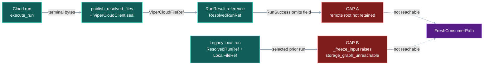
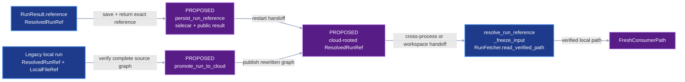
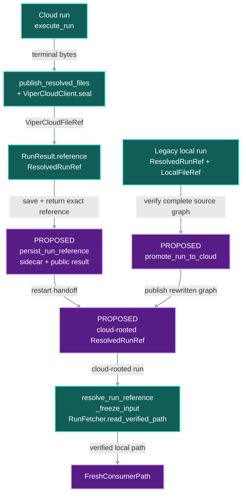

# VIPER Cloud Persistence

## 1. Status

**Contract status:** Draft for guided implementation in this chat. No VIPER
source change is accepted by this document.

| ID | Implementation obligation |
| --- | --- |
| <nobr><code>VC-REQ-01</code></nobr> | A successful cloud run atomically saves and publicly returns its exact cloud-backed `ResolvedRunRef`. |
| <nobr><code>VC-REQ-02</code></nobr> | Restarted code resolves the saved reference and rejects any disagreement with the adjacent terminal `resolved.yaml`. |
| <nobr><code>VC-REQ-03</code></nobr> | An explicit producer-side operation promotes one verified local run graph to ViperCloud without executing a stage. |
| <nobr><code>VC-REQ-04</code></nobr> | Promotion preserves scientific payload bytes, canonical paths, producer relationships, and verified download-rooted lineage while giving rewritten protocol documents new identities. |
| <nobr><code>VC-REQ-05</code></nobr> | A fresh workspace consumes the cloud-rooted graph through VIPER and receives verified local paths without seeing provider configuration. |

<!-- contract-protocol:generated:start -->
**In progress.** [Jump to current PairBlock](#vc-pb-01)

**Checklist:** [VIPER cloud persistence](../checklists/viper-cloud-persistence.md)

### PairBlocks

<a id="vc-pb-01"></a>

#### <nobr><code>VC-PB-01</code></nobr>

**Status:** drafting

**Requirement contribution:** Persist, return, reload, and verify one cloud-backed terminal run reference.

**Plan:** None

**Current receipt:** None

**Dependencies:** None

**Next action:** Run the current PairBlock plan.

<a id="vc-pb-02"></a>

#### <nobr><code>VC-PB-02</code></nobr>

**Status:** waiting

**Requirement contribution:** Add explicit verified local-to-cloud run-graph promotion without stage execution.

**Plan:** None

**Current receipt:** None

**Dependencies:** <nobr><code>VC-PB-01</code></nobr>

**Next action:** Wait for the declared dependencies.

<a id="vc-pb-03"></a>

#### <nobr><code>VC-PB-03</code></nobr>

**Status:** waiting

**Requirement contribution:** Prove that promotion preserves scientific payload identities, canonical paths, graph meaning, and download-rooted lineage.

**Plan:** None

**Current receipt:** None

**Dependencies:** <nobr><code>VC-PB-02</code></nobr>

**Next action:** Wait for the declared dependencies.

<a id="vc-pb-04"></a>

#### <nobr><code>VC-PB-04</code></nobr>

**Status:** waiting

**Requirement contribution:** Prove provider-opaque fresh-workspace consumption through the existing ViperCloud boundary and publish the final documentation.

**Plan:** None

**Current receipt:** None

**Dependencies:** <nobr><code>VC-PB-03</code></nobr>

**Next action:** Wait for the declared dependencies.


### Requirements

| Requirement | Claim | Progress | Verifiers | PairBlocks |
|---|---|---|---|---|
| <nobr><code>VC-REQ-01</code></nobr> | A successful run or retry using ViperCloudDestination must atomically save and publicly return the exact cloud-backed ResolvedRunRef created for terminal resolved.yaml. | in_progress | <nobr><code>VC-VR-01</code></nobr> | <nobr><code>VC-PB-01</code></nobr> |
| <nobr><code>VC-REQ-02</code></nobr> | resolve_run_reference must prefer an adjacent saved cloud reference, require ViperCloudFileRef storage, verify that its digest, byte count, and canonical path identify the terminal resolved.yaml, and reject any disagreement without rereading remote payload bytes. | in_progress | <nobr><code>VC-VR-02</code></nobr> | <nobr><code>VC-PB-01</code></nobr> |
| <nobr><code>VC-REQ-03</code></nobr> | An explicit producer-side promotion operation must verify a complete local run graph and return an equivalent cloud-rooted ResolvedRunRef without invoking any stage callable or mutating the source graph. | planned | <nobr><code>VC-VR-03</code></nobr> | <nobr><code>VC-PB-02</code></nobr> |
| <nobr><code>VC-REQ-04</code></nobr> | Promotion must preserve scientific payload digests and byte counts, canonical workspace-relative paths, producer and input relationships, and verified DownloadSpec-rooted lineage; every rewritten protocol document must receive the identity of its new serialized bytes. | planned | <nobr><code>VC-VR-04</code></nobr> | <nobr><code>VC-PB-03</code></nobr> |
| <nobr><code>VC-REQ-05</code></nobr> | A fresh workspace with no producer path and an empty verified-object cache must consume the cloud-rooted graph through existing VIPER authoring, verification, and materialization boundaries while stage and consumer code receive no provider client, bucket, URI, or cache selector. | planned | <nobr><code>VC-VR-05</code></nobr> | <nobr><code>VC-PB-04</code></nobr> |

### Verification rules

| Rule | Requirements | Acceptance conditions | Success case | Rejection cases |
|---|---|---|---|---|
| <nobr><code>VC-VR-01</code></nobr> | <nobr><code>VC-REQ-01</code></nobr> | Cloud run and retry success records expose the same ResolvedRunRef returned by execution and save the same serialized reference beside terminal resolved.yaml; a different existing sidecar is rejected with RunError('terminal cloud reference differs'). | [test_cloud_run_persists_and_returns_terminal_reference](../../viper/tests/test_run_execution.py) | [test_cloud_run_rejects_mismatched_terminal_reference](../../viper/tests/test_run_execution.py) |
| <nobr><code>VC-VR-02</code></nobr> | <nobr><code>VC-REQ-02</code></nobr> | Restart resolution loads a matching adjacent cloud sidecar without network I/O and rejects a non-cloud location or terminal identity mismatch with RestoreError('stored run reference differs from terminal identity'). | [test_resolve_run_reference_prefers_verified_cloud_sidecar](../../viper/tests/test_storage.py) | [test_resolve_run_reference_rejects_mismatched_cloud_sidecar](../../viper/tests/test_storage.py) |
| <nobr><code>VC-VR-03</code></nobr> | <nobr><code>VC-REQ-03</code></nobr> | Promotion verifies and publishes the reachable local graph, returns a cloud-rooted ResolvedRunRef, leaves source bytes unchanged, and records zero stage calls; missing or changed source bytes raise RunPromotionError('source run graph is unavailable'). | [test_promotes_verified_local_run_without_stage_execution](../../viper/tests/test_cloud_execution.py) | [test_promotion_rejects_missing_or_changed_source_bytes](../../viper/tests/test_cloud_execution.py) |
| <nobr><code>VC-VR-04</code></nobr> | <nobr><code>VC-REQ-04</code></nobr> | The promoted graph retains every scientific payload identity, canonical path, producer and input relationship, and required DownloadSpec root while rewritten protocol records match their new bytes; an unverified or unrooted source graph is rejected before publication. | [test_promotion_preserves_payloads_paths_and_download_lineage](../../viper/tests/test_cloud_execution.py) | [test_promotion_rejects_unverified_or_unrooted_source_graph](../../viper/tests/test_cloud_execution.py) |
| <nobr><code>VC-VR-05</code></nobr> | <nobr><code>VC-REQ-05</code></nobr> | A consumer in a fresh workspace freezes and executes against the promoted cloud root, receives verified local paths, exposes no provider configuration to stage code, and creates no duplicate immutable payload beneath .viper/store. | [test_fresh_workspace_consumes_promoted_run_through_viper_cloud](../../viper/tests/test_cloud_execution.py) | [test_cloud_pointer_rejects_a_local_producer](../../viper/tests/test_prior_run_inputs.py) |
<!-- contract-protocol:generated:end -->

## 2. Claim

When a run uses `ViperCloudDestination`, VIPER publishes its immutable payloads
once, saves one durable reference to the remote terminal run, and later returns
verified bytes or verified local paths without exposing GCS or another storage
provider to the consumer.

A legacy local run may cross that boundary only through an explicit,
fully verified promotion. Promotion never executes a stage and never mutates
the original graph.

## Current gap

### Evidence state

| State | Evidence |
| --- | --- |
| **Declared** | The workspace path remains the canonical path locally and in ViperCloud; a sealed manifest binds that path to exact bytes. |
| **Inspected** | [`execute_run()`](../../viper/src/viper/execution/_attempt.py) creates the correct cloud-backed `RunResult.reference`. |
| **Inspected** | [`RunSuccess`](../../viper/src/viper/api.py) and `RetrySuccess` omit that reference. |
| **Inspected** | [`_freeze_input()`](../../viper/src/viper/authoring.py) rejects a cloud plan whose selected producer is rooted at `LocalFileRef`. |
| **Verified** | `test_cloud_publication_is_atomic_and_retryable` and `test_attempt_publishes_evidence_to_selected_destination` pass against VIPER commit `cea4c1a0fe0aefe9cb9ccbb3e708685aa28a139a`. |
| **Verified** | `test_cloud_pointer_rejects_a_local_producer` proves the current legacy-local rejection. |
| **Proposed** | Durable run-reference persistence and local-graph promotion do not exist yet. |

### Gap analysis

The claim has two current entry paths, so each path stops at its own first
unsupported connector.

**Cloud run path.** `publish_resolved_files()` seals terminal `resolved.yaml`
and `execute_run()` constructs a correct cloud-backed `ResolvedRunRef`.
`run_request()` then constructs `RunSuccess` without that field. The first
unsupported connector is:

```text
RunResult.reference -> RunSuccess.reference
```

After the process exits, the workspace retains child cloud references but no
canonical serialized root pointer to the remote terminal document.

**Legacy local path.** A `ResolvedRunRef` rooted at `LocalFileRef` reaches
`_freeze_input()` for a cloud-destination consumer. The function raises
`ValueError("storage_graph_unreachable")`. The first unsupported connector is:

```text
verified local ResolvedRunRef -> cloud-rooted ResolvedRunRef
```

That rejection is correct until a producer-side promotion verifies and
publishes the complete reachable graph. Silently uploading during
`_freeze_input()` would hide a durable mutation inside plan authoring and would
still fail when the producer's local store is absent.

**Counterexamples.** A cloud run completes, its process exits, and another
process has only the local terminal path; the exact remote root is not directly
loadable from a retained pointer. Separately, a valid legacy run exists on its
producer machine, but a cloud consumer cannot receive an equivalent cloud root
without rerunning or manually copying its graph.

**Disposition:** gap confirmed. Preserve direct cloud publication and the
local-producer rejection. Add a durable root pointer and one explicit verified
promotion operation.

### Change-impact analysis

The fixed scenario uses `artifacts/train/model.bin` with bytes
`b"parameters"`. The intended result in every graph is:

```text
FreshConsumerPath = verified local materialization of the same model bytes
```

#### Current DAG



#### Proposed-change DAG



#### Integrated DAG



The proposed change strengthens **delivery** and **execution** guarantees. It
does not by itself establish scientific or semantic correctness; existing
domain verifiers remain responsible for those claims.

| Surface | Current | Accepted change | Disposition |
| --- | --- | --- | --- |
| `RunResult.reference` | Correct cloud root exists in memory | Persist and expose the same value | Change |
| `RunSuccess`, `RetrySuccess` | Return local paths only | Add `reference: ResolvedRunRef` | Change |
| `resolved.ref.yaml` | Absent | Serialize the exact `ResolvedRunRef` beside terminal `resolved.yaml` | PlannedAddition |
| `resolve_run_reference()` | A terminal path becomes a `LocalFileRef` | Prefer and verify adjacent `resolved.ref.yaml`; retain local fallback when absent | Change |
| `_freeze_input()` local/cloud rejection | Rejects `LocalFileRef` for a cloud consumer | Keep the rejection; require explicit promotion first | Retain |
| `promote_run_to_cloud()` | Absent | Verify, transform, publish, and return one cloud root without stage execution | PlannedAddition |
| Scientific payload identity | Exact SHA-256 and byte count | Unchanged | Retain |
| Rewritten protocol-document identity | Local references are part of serialized bytes | Recompute after replacing storage references | Change |
| Provider boundary | `ViperCloudClient`; GCS adapter exists | Reuse unchanged | Retain |
| `.viper/store` in cloud mode | No duplicate immutable payload | Keep absent | Retain |

**Verdict:** implement. The design reuses the current publisher, cloud client,
fetcher, verifier, canonical paths, and reference models. It adds one small
pointer document and one explicit graph transformation.

## 3. Models

| Model or field | Exact role |
| --- | --- |
| `ViperCloudFileRef(owner, workspace, revision, path)` | Existing provider-neutral immutable address; unchanged. |
| `ResolvedRunRef(sha256, bytes, stored_at)` | Existing content identity plus terminal location; unchanged. |
| `RunSuccess.reference: ResolvedRunRef` | Proposed public return of the successful run's exact root. |
| `RetrySuccess.reference: ResolvedRunRef` | Proposed public return of the retry's exact root. |
| `resolved.ref.yaml` | Proposed serialization of one `ResolvedRunRef`; adjacent to terminal `resolved.yaml`; contains no artifact bytes. |
| `promote_run_to_cloud(root, source, destination, cloud_client)` | Proposed explicit operation returning a cloud-rooted `ResolvedRunRef`. |

`resolved.ref.yaml` is a control pointer, not another scientific artifact. It
does not create an infinite remote-reference requirement.

## 4. Execution

1. A cloud run uses the existing publisher to upload and seal its terminal
   document.
2. `execute_run()` constructs the existing `RunResult.reference`.
3. VIPER serializes that exact value to adjacent `resolved.ref.yaml`, then
   returns it through `RunSuccess.reference` or `RetrySuccess.reference`.
4. After restart, `resolve_run_reference()` loads the sidecar and checks that
   its digest, byte count, and canonical path identify adjacent `resolved.yaml`.
   It does not reread the remote payload; the existing materialization boundary
   verifies remote bytes when a consumer actually requests them.
5. For a legacy local run, the producer explicitly calls
   `promote_run_to_cloud()` while its local store is available.
6. Promotion verifies the source graph, walks it bottom-up, publishes unchanged
   scientific payloads, rewrites storage references in protocol documents,
   recomputes those document identities, and seals the cloud graph.
7. A fresh consumer uses the cloud-rooted `ResolvedRunRef`; existing authoring,
   verification, and materialization return a verified local path.

## 5. Persisted evidence

| Record | Exact evidence |
| --- | --- |
| Terminal `resolved.yaml` | Existing terminal status and child-reference graph. |
| Adjacent `resolved.ref.yaml` | Exact remote root for the terminal bytes. |
| ViperCloud manifest | Exact path, digest, and byte count for each sealed revision. |
| Promoted terminal graph | New protocol-document identities and preserved semantic producer/input relationships. |
| Existing download-source closure receipts | Proof that required raw-data branches terminate at verified `DownloadSpec` stages. |
| Focused gate receipts | Source, type, test, documentation, and lint results for each PairBlock. |

## 6. Verification

| Rule | Executable condition |
| --- | --- |
| <nobr><code>VC-VR-01</code></nobr> | `tests/test_run_execution.py::test_cloud_run_persists_and_returns_terminal_reference` proves the saved and returned references equal `RunResult.reference`; `test_cloud_run_rejects_mismatched_terminal_reference` rejects a different digest, byte count, location, or path with `RunError("terminal cloud reference differs")`. |
| <nobr><code>VC-VR-02</code></nobr> | `tests/test_storage.py::test_resolve_run_reference_prefers_verified_cloud_sidecar` proves restart recovery without cloud I/O; `test_resolve_run_reference_rejects_mismatched_cloud_sidecar` rejects a non-cloud location or terminal disagreement with `RestoreError("stored run reference differs from terminal identity")`. |
| <nobr><code>VC-VR-03</code></nobr> | `tests/test_cloud_execution.py::test_promotes_verified_local_run_without_stage_execution` proves explicit promotion and zero stage calls; `test_promotion_rejects_missing_or_changed_source_bytes` rejects with `RunPromotionError("source run graph is unavailable")`. |
| <nobr><code>VC-VR-04</code></nobr> | `tests/test_cloud_execution.py::test_promotion_preserves_payloads_paths_and_download_lineage` compares payload identities, canonical paths, producer edges, and download roots; `test_promotion_rejects_unverified_or_unrooted_source_graph` rejects before publication. |
| <nobr><code>VC-VR-05</code></nobr> | `tests/test_cloud_execution.py::test_fresh_workspace_consumes_promoted_run_through_viper_cloud` restores and consumes from an empty workspace; existing direct-cloud tests still pass and `.viper/store` remains absent. |

## 7. Propagation

| Surface | Required change |
| --- | --- |
| [`src/viper/api.py`](../../viper/src/viper/api.py) | Add `reference` to public run and retry success models and handlers. |
| [`src/viper/execution/_attempt.py`](../../viper/src/viper/execution/_attempt.py) | Persist the exact successful terminal reference after publication. |
| [`src/viper/execution/_restore.py`](../../viper/src/viper/execution/_restore.py) | Load and verify the adjacent cloud reference before local fallback. |
| `src/viper/execution/_promotion.py` | Add the bounded verified local-to-cloud graph transformation. |
| [`src/viper/execution/__init__.py`](../../viper/src/viper/execution/__init__.py) | Export the promotion operation without exposing provider internals. |
| `src/viper/execution/errors.py` | Add `RunPromotionError` for promotion-boundary failures. |
| [`src/viper/authoring.py`](../../viper/src/viper/authoring.py) | Retain `storage_graph_unreachable` for an unpromoted local producer in a cloud plan. |
| Tests and public documentation | Add the named rejection boundaries and update run, retry, restore, promotion, and cloud-path guidance. |

## 8. Acceptance case

### Success

A producer with an available verified local run calls `promote_run_to_cloud()`.
No stage callable runs. VIPER returns a cloud-rooted `ResolvedRunRef` and saves
it beside the local terminal document. A fresh workspace with no producer path
and empty verified-object cache uses that reference to freeze and execute a
consumer. The consumer receives the original `model.bin` bytes at its declared
input path and never receives a bucket, URI, provider client, or cache selector.

### Rejection

Promotion stops before publication when a required source byte sequence is
missing, changed, or fails the existing run verifier. Restart resolution stops
when `resolved.ref.yaml` disagrees with adjacent terminal bytes. A cloud plan
still rejects an unpromoted `LocalFileRef` with
`ValueError("storage_graph_unreachable")`.

## 9. Implementation order

1. <nobr><code>VC-PB-01</code></nobr>: durable cloud run reference.
2. <nobr><code>VC-PB-02</code></nobr>: verified explicit graph promotion.
3. <nobr><code>VC-PB-03</code></nobr>: lineage and identity acceptance.
4. <nobr><code>VC-PB-04</code></nobr>: fresh-workspace consumer acceptance and documentation.

We will implement these in guided mode in this chat. Each PairBlock gets one
complete bounded edit, its focused check, Pyright, affected tests,
documentation checks, and final non-mutating Ruff checks before the next block.

## 10. Master checklist

The [VIPER cloud persistence checklist](../checklists/viper-cloud-persistence.md)
places each requirement once. It contains no competing design prose.

## 11. Contract-owned PairBlocks

| PairBlock | Requirements | Focused result |
| --- | --- | --- |
| <nobr><code>VC-PB-01</code></nobr> | <nobr><code>VC-REQ-01</code></nobr>, <nobr><code>VC-REQ-02</code></nobr> | A cloud run saves, returns, reloads, and verifies one exact terminal reference. |
| <nobr><code>VC-PB-02</code></nobr> | <nobr><code>VC-REQ-03</code></nobr> | Explicit promotion returns a cloud root without stage execution. |
| <nobr><code>VC-PB-03</code></nobr> | <nobr><code>VC-REQ-04</code></nobr> | Promotion preserves payload identities, paths, graph meaning, and download roots. |
| <nobr><code>VC-PB-04</code></nobr> | <nobr><code>VC-REQ-05</code></nobr> | A fresh workspace consumes the promoted artifact through the existing ViperCloud boundary. |

## 12. ContractTarget

The current guided PairBlock will receive a candidate-bound `PairBlockPlan`
only after its complete source, test, documentation, and gate targets are known.
Every proposed path begins as `PlannedAddition`; the candidate's added paths
must equal that set. No plan may modify MANTRA or RICO implementation files.

## Sources

- VIPER commit `cea4c1a0fe0aefe9cb9ccbb3e708685aa28a139a`.
- [`docs/reference/protocol.md`](../../viper/docs/reference/protocol.md),
  workspace and cloud path contract.
- [`src/viper/storage.py`](../../viper/src/viper/storage.py), current
  publication and `ViperCloudClient` boundary.
- [`src/viper/execution/_source.py`](../../viper/src/viper/execution/_source.py),
  current verified materialization boundary.
