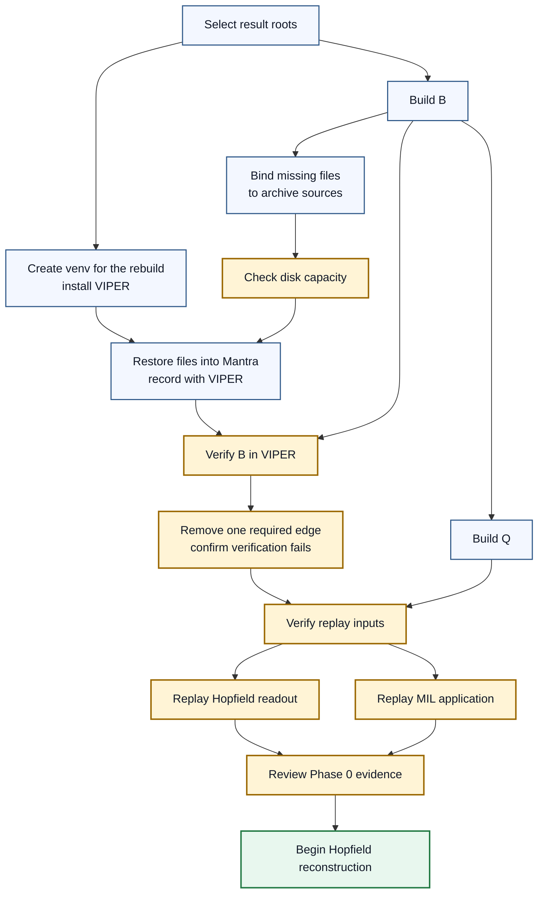

# Mantra Rebuild Phase 0 Contract

## 1. Status

**Contract status:** Final

**Approval state:** Approved

This contract governs artifact discovery, capacity planning, restoration, and provenance capture before the Hopfield or MIL rebuild begins. The model rebuild remains out of scope until every Phase 0 acceptance condition passes. The user actively reviews each PairBlock's scope, proposed work, observed result, and gate evidence before the next PairBlock begins.

| ID | Implementation obligation |
|---|---|
| `P0-REQ-01` | Define $B$ for the selected Hopfield and MIL outputs. |
| `P0-REQ-02` | Give every restored file node in $B$ one verified `RestorationBinding`. |
| `P0-REQ-03` | Calculate the maximum simultaneous local storage requirement before downloading an archive. |
| `P0-REQ-04` | Restore verified files to their canonical, Git-ignored paths inside the MANTRA checkout. |
| `P0-REQ-05` | Run restoration from the MANTRA workspace with a released, pinned `viper-provenance` distribution. |
| `P0-REQ-06` | Record and verify $B$ in the VIPER provenance graph. |
| `P0-REQ-07` | Replay the historical Hopfield raw-gene readout from its saved encoder and restored inputs. |
| `P0-REQ-08` | Replay the saved MIL application from restored inputs. |
| `P0-REQ-09` | Maintain an independent usefulness ledger for VIPER checks, failures, costs, and confirmed findings. |

## 2. Required claim

Before a model rebuild starts, VIPER can trace each selected result through every file the rebuild reads and every producer entrypoint it executes.

The graph $B=(F,P,E)$ contains:

- $F$ contains exact file identities. A file enters $F$ only when a selected rebuild stage reads it or an upstream stage produces it.
- $P$ contains exact producer entrypoints. Each entrypoint is identified by repository commit, source path, symbol, source-file byte count, and source-file SHA-256.
- $E$ contains `consumes` edges from files to producer entrypoints and `produces` edges from producer entrypoints to files.

A `consumes` edge requires both a named stage input and an inspected read of that input by the producer. A `produces` edge requires both a declared stage output and a successful run receipt for that output. Every member of $F \cup P$ must lie on a directed path ending at the selected Hopfield or MIL output. Severing any required node or edge must make graph verification fail.

Historical predictions, checkpoints, and reports used only to compare the rebuild form a separate parity-reference graph $Q$. No member of $Q$ may enter a reconstruction or training stage as an input.

This claim establishes byte identity, executed-producer identity, and graph completeness. Historical training reproducibility and scientific correctness remain later acceptance boundaries.

## 3. Current gap

The repository contains restoration controls, artifact pointers, application verification inputs, and historical producer code. The missing rebuild-specific graph must identify the selected result first, then trace only the files and producers required to rebuild it.

The first missing result is therefore the complete graph $B$. When the signed Hugging Face records identify an absent local file's bytes, Phase 0 classifies that file as a restoration task. An unrecoverable classification requires a failed search of the signed restoration records.

## 4. Restoration and storage contract

### `RestorationBinding`

`RestorationBinding` tells the MANTRA restoration stage where one required file belongs, where its archived bytes reside, and which bytes must result. For a file node $f \in F$:

$$
r=(f,d,s,c),\qquad
s=(repo,revision,archive,member),\qquad
c=(bytes,sha256).
$$

Here $d$ is the destination relative to the MANTRA repository root. The value $s$ identifies one member of one archive at one immutable Hugging Face revision. The value $c$ identifies the extracted file bytes. The binding contains no producer or consumer list; $B$ owns those relationships.

RICO owns this definition and its approval history. The proposed executable type is `experiments/v1954_hopfield_mil_rebuild/src/restoration/models.py::RestorationBinding` in MANTRA. Its reviewed instances belong in `experiments/v1954_hopfield_mil_rebuild/specs/restoration/bindings.json`. VIPER stores each resolved binding with the run evidence that used it.

### Ownership boundary

RICO contains forward-looking contracts and review records. MANTRA contains executable restoration records, restoration code, restored files, rebuild code, and VIPER run evidence. Restoration uses VIPER as an installed external library; this project does not import from or modify the VIPER source checkout.

The MANTRA execution environment will live at `experiments/v1954_hopfield_mil_rebuild/.venv`. Its checked-in lock file will live at `experiments/v1954_hopfield_mil_rebuild/specs/runtime/requirements.lock`. The lock must select `viper-provenance==0.1.0a3` by released distribution hash. An editable VIPER installation fails the environment gate.

### Local storage

Phase 0 uses three storage roles:

| Role | Local path | Retention rule |
|---|---|---|
| Download cache | `/Users/machina/Developer/ChatGPT/mantra-restoration-cache/` | Holds Hugging Face archive chunks during restoration. A cache file may be removed only after its download and extraction evidence is present in VIPER and the user authorizes removal. |
| Canonical restored files | `/Users/machina/Developer/ChatGPT/mantra/` at each documented repository-relative destination | Holds the verified files consumed by MANTRA. Historical names and paths remain unchanged. |
| VIPER evidence | `/Users/machina/Developer/ChatGPT/mantra/.viper/store/` and `/Users/machina/Developer/ChatGPT/mantra/.viper/catalog.sqlite3` | Holds the provenance objects and graph catalog produced by governed runs. |

Phase 0 restores files only to the download cache, their canonical paths in the MANTRA checkout, and the declared VIPER evidence paths. Restoration scripts receive these roots explicitly. The RICO repositories, historical `/home/machina/MANTRA`, and `/dev/shm` are outside the local restoration boundary.

### Capacity gate

Before the first archive download, Phase 0 must measure current free space and calculate:

$$
R_{max}=C+D+V+T+H,
$$

| Symbol | Required measurement |
|---|---|
| $C$ | Maximum compressed cache retained at once. |
| $D$ | Extracted canonical footprint. |
| $V$ | Additional bytes retained by VIPER. |
| $T$ | Peak temporary extraction space. |
| $H$ | 20 GiB reserved free space. |

The download gate passes only when observed free space is at least $R_{max}$. Shared archive chunks count once.

## 5. Execution roadmap

$B$ contains the files, programs, and read/write links required to reproduce the selected Hopfield and MIL results. $Q$ contains historical outputs used only for comparison.



1. Confirm the selected Hopfield and MIL result files that terminate $B$.
2. Create the MANTRA development environment and prove that it uses the released VIPER distribution.
3. Trace the Hopfield result backward to its required file nodes, producer entrypoints, and edges.
4. Trace the MIL result backward through its required file nodes, producer entrypoints, and edges.
5. Classify historical comparison files in $Q$ so they cannot feed the rebuild.
6. Write one `RestorationBinding` for each absent file node in $B$.
7. Calculate $R_{max}$ and stop if the capacity gate fails.
8. Download and extract the required archive members through MANTRA-rooted VIPER stages.
9. Verify $B$, including a rejection case with one required relationship severed.
10. Replay the historical Hopfield raw-gene readout and the saved MIL application.
11. Freeze Phase 0 evidence and request approval to begin Hopfield reconstruction.

## 6. Persisted evidence

| Evidence | Required content |
|---|---|
| Graph $B$ | Every required member of $F$, $P$, and $E$, with the selected result as its terminal node. |
| Restoration bindings | One reviewed $r=(f,d,s,c)$ record for every absent restored file in $F$. |
| Environment receipt | Python executable, installed VIPER version, installed distribution identity, lock-file identity, and editable-install rejection result. |
| Capacity receipt | The measured terms in $R_{max}=C+D+V+T+H$, the measurement time, and the gate result. |
| Restoration receipt | The resolved `RestorationBinding` and outcome for each restored file. |
| VIPER graph | The verified runtime representation of $B$. |
| Graph-completeness report | Missing members of $F$, $P$, or $E$, plus the pass or fail result. |
| Hopfield replay receipt | Approved command, saved-encoder identity, input digests, produced predictions, metric, tolerance, and comparison result. |
| MIL replay receipt | Exact command, environment, input digests, output digests, metrics, tolerances, and comparison result. |
| VIPER usefulness ledger | Claimed check, real defect detected, independent confirmation, ordinary-test coverage, false alarms, infrastructure failures, time cost, and later reuse. |

The dependency graph, restoration bindings, environment receipt, capacity receipt, restoration receipts, completeness report, both replay receipts, and usefulness ledger must themselves be registered in VIPER. Each checked-in evidence file requires a corresponding graph record.

## 7. Verification

| Rule | Executable condition |
|---|---|
| `P0-VR-01` | Every member of $F \cup P$ lies on a path ending at a selected result, and every edge in $E$ has its required evidence. |
| `P0-VR-02` | Every absent restored file in $F$ has exactly one valid `RestorationBinding`. |
| `P0-VR-03` | The measured free space is greater than or equal to $R_{max}$ before download begins. |
| `P0-VR-04` | Every materialized file exists at its canonical path and matches its declared byte count and SHA-256. |
| `P0-VR-05` | The active Python environment contains the released `viper-provenance==0.1.0a3` distribution selected by the checked-in lock file. |
| `P0-VR-06` | The VIPER graph contains every member of $B$, and severing one required node or edge makes verification fail. |
| `P0-VR-07` | The Hopfield replay reproduces the selected raw-gene readout score `0.5861640938949398` within the approved tolerance and retains its produced predictions. |
| `P0-VR-08` | The saved MIL application reproduces the hashes and metrics declared by `reinstantiation/APPLICATION_VERIFICATION.json` within its stated tolerances. |
| `P0-VR-09` | Every assessed VIPER check has a usefulness-ledger row and independent evidence for any confirmed defect. |

## 8. Acceptance boundary

### Success

Phase 0 passes when `P0-VR-01` through `P0-VR-09` pass, every required provenance record exists in VIPER, the user reviews the complete evidence set, and the repository contains a synced commit recording the approved contract and Phase 0 receipts.

### Rejection

Phase 0 fails when $B$ contains an unnecessary node, omits a required node or edge, admits a parity reference as a rebuild input, lacks a `RestorationBinding`, exceeds available storage, uses an editable VIPER checkout, restores different bytes, or either replay exceeds its approved tolerance.

## 9. PairBlock order

| PairBlock | Bounded deliverable | Gate |
|---|---|---|
| `P0-PB-01` | Selected result roots and external-VIPER development environment | User approves both roots; `P0-VR-05` passes. |
| `P0-PB-02` | Complete Hopfield subgraph of $B$ | `P0-VR-01` for Hopfield. |
| `P0-PB-03` | Complete MIL subgraph of $B$ | `P0-VR-01` for MIL. |
| `P0-PB-04` | `RestorationBinding` implementation and reviewed records | `P0-VR-02`. |
| `P0-PB-05` | Capacity receipt and download plan | `P0-VR-03`. |
| `P0-PB-06` | Verified restoration and graph-completeness rejection test | `P0-VR-04` and `P0-VR-06`. |
| `P0-PB-07` | Historical Hopfield raw-gene readout replay | `P0-VR-07`. |
| `P0-PB-08` | Saved MIL application replay | `P0-VR-08`. |
| `P0-PB-09` | Phase 0 evidence freeze and usefulness assessment | `P0-VR-09` and user approval. |

### `P0-PB-01` proposed implementation

**Status:** Proposed — awaiting user review

**Requirement:** Record the two approved result roots and prove that the experiment uses Python 3.13 with the released `viper-provenance==0.1.0a3` wheel.

**Dependency:** The approved Hopfield target is `0.5861640938949398`; the approved MIL target is `0.6025499488874759`.

**Targets:**

- `experiments/v1954_hopfield_mil_rebuild/JOURNAL.md`
- `experiments/v1954_hopfield_mil_rebuild/specs/selected_results.yaml`
- `experiments/v1954_hopfield_mil_rebuild/specs/runtime/requirements.lock`
- `experiments/v1954_hopfield_mil_rebuild/scripts/verify_viper_environment.py`
- `experiments/v1954_hopfield_mil_rebuild/tests/test_verify_viper_environment.py`
- `experiments/v1954_hopfield_mil_rebuild/diagnostics/VIPER_ENVIRONMENT.json`, generated by the verifier

Context: MANTRA requires Python 3.13. This block records the selected results and installs the published VIPER wheel by its SHA-256. The verifier rejects a different wheel, an editable installation, or Python outside the experiment venv.

**File: `experiments/v1954_hopfield_mil_rebuild/JOURNAL.md`**

```markdown
# Hopfield and MIL Rebuild

**Date:** 2026-09-11
**Status:** In Progress
**Git base:** `829bfd3840e6a3ac2992e7524b5c8a5111c26d7c`
**Contract:** RICO commit `ba39332`

## Hypothesis

The restored historical inputs and reconstructed stages can reproduce the approved Hopfield and MIL results.

## Initial scope

Phase 0 records the selected results, restores their required files, verifies their provenance in VIPER, and replays both inference paths. Training begins after Phase 0 passes.

## Tasks

- [ ] Verify the Python and VIPER environment.
- [ ] Build graph B.
- [ ] Restore the missing files.
- [ ] Replay the Hopfield readout.
- [ ] Replay the MIL application.

## Observations

The selected Hopfield result is `0.5861640938949398`. The selected MIL result is `0.6025499488874759`.
```

**File: `experiments/v1954_hopfield_mil_rebuild/specs/selected_results.yaml`**

```yaml
schema_version: mantra_selected_results.v1

hopfield:
  prediction:
    path: experiments/v1938_sota_clean_repro/runs/matrix_fit_only_bold_step02_20260715T083000Z/out/raw_gene_readout_tuning_fit_only/best/RAW_GENE_PREDICTIONS.npz
    sha256: d7180c4669a11b0b2fb184814aafb48ebafe75b02e4bd07998c337aa64dc59b7
  measurement:
    report: experiments/v1938_sota_clean_repro/runs/matrix_fit_only_bold_step02_20260715T083000Z/diagnostics/RAW_GENE_READOUT_TUNING_FIT_ONLY_RESULTS.json
    report_sha256: cbb3d786ff85ce15eed5e16335cf7d9a28c7ad3f076b6f019c58e4a16c140a10
    json_path: [best_row, scores, hold_PearsonDelta]
    expected: 0.5861640938949398
    absolute_tolerance: 1.0e-8

mil:
  prediction:
    path: experiments/v1953_direct_mil_simplified_scorer_promotion/runs/simplified_scorer_full_stack_20260725T000500Z/step02_step03/checkpoints/mean/STEP03_GENE_PREDICTIONS.npz
    sha256: e39230c8c17954602a2c3dbfc26ed4759922be36bdabc6b27ffb96204a07f7fd
  measurement:
    report: experiments/v1953_direct_mil_simplified_scorer_promotion/runs/simplified_scorer_full_stack_20260725T000500Z/step02_step03/diagnostics/STEP03_RESULT_REPORT.json
    report_sha256: b410e7abd34645a2b990733b392d1cdfeb9d61dc65393d1dcfcc697b853d351f
    json_path: [best_by_step03_hold, 0, scores, hold_PearsonDelta]
    expected: 0.6025499488874759
    absolute_tolerance: 1.0e-8
```

**File: `experiments/v1954_hopfield_mil_rebuild/specs/runtime/requirements.lock`**

```text
viper-provenance @ https://files.pythonhosted.org/packages/18/bf/484f4b0cb31f500dcc9b14ca7fec4c1081dc58ec3ea0503c6b46f7a41236/viper_provenance-0.1.0a3-py3-none-any.whl#sha256=443a9ab15732588b07add7e8f658006076558a1366df78fe541e258b05ba11ac
```

**File: `experiments/v1954_hopfield_mil_rebuild/scripts/verify_viper_environment.py`**

```python
from __future__ import annotations

import json
import sys
from hashlib import sha256
from importlib.metadata import distribution, version
from pathlib import Path
from typing import Any

import viper


EXPERIMENT_ROOT = Path(__file__).resolve().parents[1]
LOCK_PATH = EXPERIMENT_ROOT / "specs/runtime/requirements.lock"
RECEIPT_PATH = EXPERIMENT_ROOT / "diagnostics/VIPER_ENVIRONMENT.json"
VIPER_VERSION = "0.1.0a3"
VIPER_WHEEL_URL = (
    "https://files.pythonhosted.org/packages/18/bf/"
    "484f4b0cb31f500dcc9b14ca7fec4c1081dc58ec3ea0503c6b46f7a41236/"
    "viper_provenance-0.1.0a3-py3-none-any.whl"
)
VIPER_WHEEL_SHA256 = "443a9ab15732588b07add7e8f658006076558a1366df78fe541e258b05ba11ac"


def validate_environment(
    *,
    python_version: tuple[int, int],
    python_prefix: Path,
    venv_root: Path,
    installed_version: str,
    module_path: Path,
    direct_url: dict[str, Any],
    lock_text: str,
) -> None:
    if python_version != (3, 13):
        raise RuntimeError(f"expected Python 3.13, found {python_version[0]}.{python_version[1]}")
    if python_prefix.resolve() != venv_root.resolve():
        raise RuntimeError(f"active Python prefix is outside {venv_root}: {python_prefix}")
    if installed_version != VIPER_VERSION:
        raise RuntimeError(f"expected VIPER {VIPER_VERSION}, found {installed_version}")
    if not module_path.resolve().is_relative_to(venv_root.resolve()):
        raise RuntimeError(f"VIPER module is outside {venv_root}: {module_path}")
    if direct_url.get("dir_info", {}).get("editable") is True:
        raise RuntimeError("VIPER is installed in editable mode")
    wheel_hash = direct_url.get("archive_info", {}).get("hashes", {}).get("sha256")
    if wheel_hash != VIPER_WHEEL_SHA256:
        raise RuntimeError(f"expected VIPER wheel SHA-256 {VIPER_WHEEL_SHA256}, found {wheel_hash}")
    expected_lock = f"viper-provenance @ {VIPER_WHEEL_URL}#sha256={VIPER_WHEEL_SHA256}\n"
    if lock_text != expected_lock:
        raise RuntimeError("requirements.lock does not select the approved VIPER wheel")


def direct_url_record() -> dict[str, Any]:
    installed = distribution("viper-provenance")
    direct_url_file = next(
        (installed.locate_file(item) for item in installed.files or () if item.name == "direct_url.json"),
        None,
    )
    if direct_url_file is None:
        raise RuntimeError("VIPER installation has no direct_url.json")
    return json.loads(Path(direct_url_file).read_text(encoding="utf-8"))


def main() -> None:
    venv_root = EXPERIMENT_ROOT / ".venv"
    executable = Path(sys.executable)
    module_path = Path(viper.__file__).resolve()
    installed_version = version("viper-provenance")
    direct_url = direct_url_record()
    lock_text = LOCK_PATH.read_text(encoding="utf-8")
    validate_environment(
        python_version=sys.version_info[:2],
        python_prefix=Path(sys.prefix),
        venv_root=venv_root,
        installed_version=installed_version,
        module_path=module_path,
        direct_url=direct_url,
        lock_text=lock_text,
    )
    receipt = {
        "schema_version": "mantra_viper_environment.v1",
        "python_executable": str(executable),
        "python_prefix": str(Path(sys.prefix).resolve()),
        "python_version": ".".join(str(value) for value in sys.version_info[:3]),
        "viper_module": str(module_path),
        "viper_version": installed_version,
        "editable": False,
        "viper_wheel_url": direct_url["url"],
        "viper_wheel_sha256": VIPER_WHEEL_SHA256,
        "requirements_lock": str(LOCK_PATH.relative_to(EXPERIMENT_ROOT)),
        "requirements_lock_sha256": sha256(lock_text.encode("utf-8")).hexdigest(),
        "status": "passed",
    }
    RECEIPT_PATH.parent.mkdir(parents=True, exist_ok=True)
    RECEIPT_PATH.write_text(json.dumps(receipt, indent=2, sort_keys=True) + "\n", encoding="utf-8")
    print(json.dumps(receipt, indent=2, sort_keys=True))


if __name__ == "__main__":
    main()
```

**File: `experiments/v1954_hopfield_mil_rebuild/tests/test_verify_viper_environment.py`**

```python
from pathlib import Path
from typing import Any
from unittest import TestCase

from experiments.v1954_hopfield_mil_rebuild.scripts.verify_viper_environment import (
    VIPER_VERSION,
    VIPER_WHEEL_SHA256,
    VIPER_WHEEL_URL,
    validate_environment,
)


VENV_ROOT = Path("/work/mantra/experiments/v1954_hopfield_mil_rebuild/.venv")
LOCK_TEXT = f"viper-provenance @ {VIPER_WHEEL_URL}#sha256={VIPER_WHEEL_SHA256}\n"


def valid_arguments() -> dict[str, Any]:
    return {
        "python_version": (3, 13),
        "python_prefix": VENV_ROOT,
        "venv_root": VENV_ROOT,
        "installed_version": VIPER_VERSION,
        "module_path": VENV_ROOT / "lib/python3.13/site-packages/viper/__init__.py",
        "direct_url": {
            "archive_info": {"hashes": {"sha256": VIPER_WHEEL_SHA256}},
            "url": VIPER_WHEEL_URL,
        },
        "lock_text": LOCK_TEXT,
    }


class VerifyViperEnvironmentTests(TestCase):
    def test_accepts_published_wheel_in_experiment_venv(self) -> None:
        validate_environment(**valid_arguments())

    def test_rejects_different_wheel_hash(self) -> None:
        arguments = valid_arguments()
        arguments["direct_url"] = {
            "archive_info": {"hashes": {"sha256": "0" * 64}},
            "url": VIPER_WHEEL_URL,
        }
        with self.assertRaisesRegex(RuntimeError, "wheel SHA-256"):
            validate_environment(**arguments)

    def test_rejects_python_outside_experiment_venv(self) -> None:
        arguments = valid_arguments()
        arguments["python_prefix"] = Path("/another/environment")
        with self.assertRaisesRegex(RuntimeError, "Python prefix"):
            validate_environment(**arguments)

    def test_rejects_editable_installation(self) -> None:
        arguments = valid_arguments()
        arguments["direct_url"] = {"dir_info": {"editable": True}}
        with self.assertRaisesRegex(RuntimeError, "editable mode"):
            validate_environment(**arguments)

    def test_rejects_changed_lock(self) -> None:
        arguments = valid_arguments()
        arguments["lock_text"] = "viper-provenance==0.1.0a3\n"
        with self.assertRaisesRegex(RuntimeError, "requirements.lock"):
            validate_environment(**arguments)
```

**Installation and focused gate:**

```bash
cd /Users/machina/Developer/ChatGPT/mantra
source experiments/v1954_hopfield_mil_rebuild/.venv/bin/activate
python -m pip install --requirement experiments/v1954_hopfield_mil_rebuild/specs/runtime/requirements.lock
PYTHONPATH=. python -m unittest experiments.v1954_hopfield_mil_rebuild.tests.test_verify_viper_environment -v
python experiments/v1954_hopfield_mil_rebuild/scripts/verify_viper_environment.py
```

**Gate:** The five tests pass, the verifier exits successfully, and `diagnostics/VIPER_ENVIRONMENT.json` identifies Python 3.13, VIPER `0.1.0a3`, the lock-file SHA-256, and wheel SHA-256 `443a9ab15732588b07add7e8f658006076558a1366df78fe541e258b05ba11ac`.

**Stop condition:** Stop before building $B$ if installation, any test, or the verifier fails. The user reviews the applied MANTRA diff and receipt before this PairBlock closes.

For each PairBlock, Codex drafts the proposed contract or source, the user reviews it, Codex performs the agreed code review, the user implements approved code, and Codex reviews the applied diff and focused gate. A PairBlock closes only when the implementation, test result, Git evidence, and VIPER evidence agree.

## 10. Sources

- MANTRA: `reinstantiation/README.md`
- MANTRA: `reinstantiation/REINSTANTIATION_ROOT_RELEASE.json`
- MANTRA: `reinstantiation/APPLICATION_VERIFICATION.json`
- MANTRA: `docs/EXPERIMENT_ARCHIVE_AND_DELETE.md`
- MANTRA: `archive_pointers/`
- RICO: [`mantra-viper-rebuild-handoff.md`](../mantra-viper-rebuild-handoff.md)
