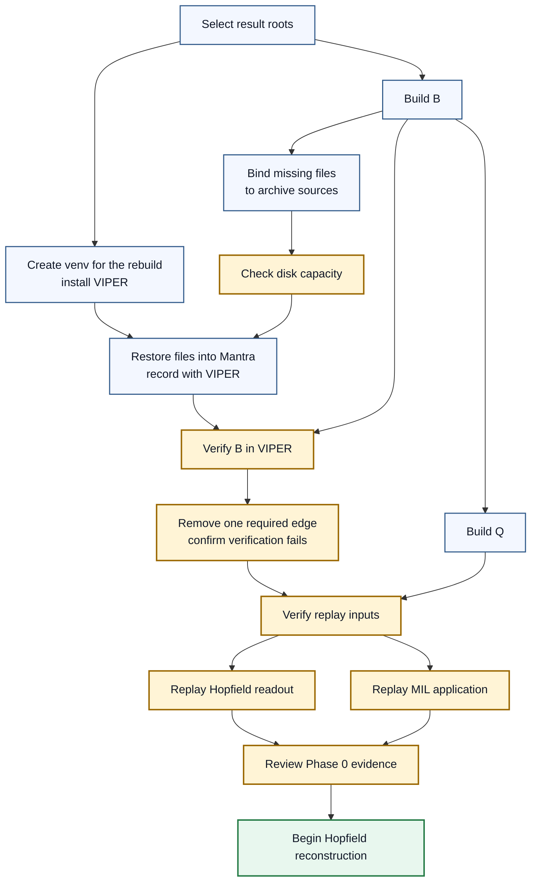

# Mantra Rebuild Phase 0 Contract

## 1. Status

**Contract status:** Final

**Approval state:** Approved

This contract governs artifact discovery, capacity planning, restoration, and provenance capture before the Hopfield or MIL rebuild begins. The model rebuild remains out of scope until every Phase 0 acceptance condition passes. The user actively reviews each PairBlock's scope, proposed work, observed result, and gate evidence before the next PairBlock begins.

The [Mantra rebuild master checklist](../checklists/mantra-rebuild.md) owns execution order, current status, and the next action. This contract owns Phase 0 requirements, PairBlock definitions, source proposals, and gates.

## Table of contents

- [Status](#1-status)
  - [Phase 0 requirement map](#phase-0-requirement-map)
- [Required claim](#2-required-claim)
- [Current gap](#3-current-gap)
- [Restoration and storage contract](#4-restoration-and-storage-contract)
- [Phase 0 dependency model](#5-phase-0-dependency-model)
- [Persisted evidence](#6-persisted-evidence)
- [Verification](#7-verification)
- [Acceptance boundary](#8-acceptance-boundary)
- [PairBlock order](#9-pairblock-order)
  - [Phase 0 ownership record](#phase-0-ownership-record)
- [Implementation records](#10-implementation-records)
- [Sources](#11-sources)

### Phase 0 requirement map

| ID | Contract boundary | Owning block declarations |
|---|---|---|
| `P0-REQ-01` | Define $B$ for the selected Hopfield and MIL outputs. | [`P0-PB-02`](#p0-pb-02-declaration), [`P0-PB-03`](#p0-pb-03-declaration) |
| `P0-REQ-02` | Give every restored file node in $B$ one verified `RestorationBinding`. | [`P0-PB-04`](#p0-pb-04-declaration), [`P0-PB-04A`](#p0-pb-04a-declaration), [`P0-PB-04B`](#p0-pb-04b-declaration) |
| `P0-REQ-03` | Calculate the maximum simultaneous local storage requirement before downloading an archive. | [`P0-PB-05`](#p0-pb-05-declaration), [`P0-PB-05A`](#p0-pb-05a-declaration), [`P0-PB-05B`](#p0-pb-05b-declaration) |
| `P0-REQ-04` | Restore verified files to their canonical, Git-ignored paths inside the MANTRA checkout. | [`P0-PB-06`](#p0-pb-06-declaration) |
| `P0-REQ-05` | Run restoration from the MANTRA workspace with `viper-provenance` installed in MANTRA's `venv`. | [`P0-PB-01`](#p0-pb-01-declaration), [`P0-PB-06`](#p0-pb-06-declaration) |
| `P0-REQ-06` | Record and verify $B$ in the VIPER provenance graph. | [`P0-PB-06`](#p0-pb-06-declaration) |
| `P0-REQ-07` | Replay the historical Hopfield raw-gene readout from its saved encoder and restored inputs. | [`P0-PB-07`](#p0-pb-07-declaration) |
| `P0-REQ-08` | Replay the v1952 MIL seed-123460 `without_control` result from restored inputs. | [`P0-PB-08`](#p0-pb-08-declaration) |
| `P0-REQ-09` | Maintain an independent usefulness ledger for VIPER checks, failures, costs, and confirmed findings. | [`P0-PB-09`](#p0-pb-09-declaration) |
| `P0-REQ-10` | Compile the RICO checklist into the global master-checklist manifest and propagate each evidence-backed PairBlock transition through its checkbox, requirements, dependent blocks, and contract state. | [`P0-PB-10`](#p0-pb-10-declaration) |

## 2. Required claim

Before a model rebuild starts, VIPER can trace each selected result through every file the rebuild reads and every producer entrypoint it executes.

The graph $B=(F,P,E)$ contains:

- $F$ contains exact file identities. A file enters $F$ only when a selected rebuild stage reads it or an upstream stage produces it.
- $P$ contains exact producer entrypoints. Each entrypoint is identified by repository commit, source path, symbol, source-file byte count, and source-file SHA-256.
- $E$ contains `consumes` edges from files to producer entrypoints and `produces` edges from producer entrypoints to files.

A `consumes` edge requires both a named stage input and an inspected read of that input by the producer. A `produces` edge requires both a declared stage output and a successful run receipt for that output. Every member of $F \cup P$ must lie on a directed path ending at the selected Hopfield or MIL output. Severing any required node or edge must make graph verification fail.

The Hopfield and MIL portions of $B$ are independent. Neither model consumes an output produced by the other model. A shared raw or derived data file may appear in both portions only when each model reads that file directly.

Historical predictions, checkpoints, and reports used only to compare the rebuild form a separate parity-reference graph $Q$. Reconstruction and training stages exclude every member of $Q$ from their inputs.

This claim establishes byte identity, executed-producer identity, and graph completeness. Historical training reproducibility and scientific correctness remain later acceptance boundaries.

## 3. Current gap

The repository contains restoration controls, artifact pointers, application verification inputs, and historical producer code. The missing rebuild-specific graph must identify the selected result first, then trace only the files and producers required to rebuild it.

The first missing result is therefore the complete graph $B$. When the signed Hugging Face records identify an absent local file's bytes, Phase 0 classifies that file as a restoration task. An unrecoverable classification requires a failed search of the signed restoration records.

## 4. Restoration and storage contract

### `RestorationBinding`

`RestorationBinding` tells the MANTRA restoration stage where one required file belongs, where its archived bytes reside, and which bytes must result. For a file node $f \in F$:

$$
r=(f,d,s,c),\qquad
s=(repo,control\_revision,archive,member),\qquad
c=(bytes,sha256).
$$

Here $d$ is the destination relative to the MANTRA repository root. The value $s$ identifies the signed control package, the archive declared by that package, and the archive member that contains the file bytes. `control_revision` is the immutable Hugging Face revision containing the signed archive manifest. That manifest lists the archive's ordered parts; each part has its own immutable data revision, path, byte count, and SHA-256. The value $c$ identifies the extracted file bytes. The binding records restoration identity; $B$ records producer and consumer relationships.

RICO owns this definition and its approval history. The proposed executable type is `src/mantra/rebuild/restoration.py::RestorationBinding` in MANTRA. VIPER stores each resolved binding with the run evidence that used it; Phase 0 will select a checked-in MANTRA path for the reviewed binding set when `P0-PB-04` defines that file's consumer.

### Ownership boundary

RICO contains forward-looking contracts and review records. MANTRA contains executable restoration records, restoration code, restored files, rebuild code, and VIPER run evidence. Restoration imports the installed VIPER distribution. The VIPER source checkout remains outside the MANTRA execution path and unchanged by this work.

The existing MANTRA Git repository is the VIPER workspace. A root `viper.toml` marks that boundary because `viper.repository.resolve_root()` requires the marker to equal the Git work-tree root. `viper init` serves empty targets by generating a Python package, build configuration, test tree, and example stages. MANTRA supplies those structures itself, so Phase 0 adds only the workspace marker and MANTRA-owned adapters.

The MANTRA execution environment is the Conda environment named `mantra`. It must contain Python 3.13 and the `viper-provenance` package. The environment receipt records the environment name, Python executable, installed VIPER version, and module path as observations. The gate accepts every installed VIPER version.

New orchestration code belongs under `src/mantra/rebuild/`. It calls the historical MANTRA implementation at its current paths and preserves the historical experiment layout. The Hopfield replay adapter and its focused test are `src/mantra/rebuild/hopfield_replay.py` and `src/mantra/rebuild/tests/test_hopfield_replay.py`. `P0-PB-02` identifies every declared stage input before we draft their complete source.

### Local storage

Phase 0 uses three storage roles:

| Role | Local path | Retention rule |
|---|---|---|
| Download cache | `/Users/machina/Developer/ChatGPT/mantra-restoration-cache/` | Holds Hugging Face archive chunks during restoration. A cache file may be removed only after its download and extraction evidence is present in VIPER and the user authorizes removal. |
| Canonical restored files | `/Users/machina/Developer/ChatGPT/mantra/` at each documented repository-relative destination | Holds the verified files consumed by MANTRA. Historical names and paths remain unchanged. |
| VIPER evidence | `/Users/machina/Developer/ChatGPT/mantra/.viper/store/` and `/Users/machina/Developer/ChatGPT/mantra/.viper/catalog.sqlite3` | Holds the provenance objects and graph catalog produced by governed runs. |

Phase 0 restores files only to the download cache, their canonical paths in the MANTRA checkout, and the declared VIPER evidence paths. Restoration scripts receive these roots explicitly. The RICO repositories, historical `/home/machina/MANTRA`, and `/dev/shm` are outside the local restoration boundary.

### Capacity gate

Before the first archive download, Phase 0 must measure current free space and calculate:

$$
R_{max}=C+D+V+T+H,
$$

| Symbol | Required measurement |
|---|---|
| $C$ | Maximum compressed cache retained at once. |
| $D$ | Extracted canonical footprint. |
| $V$ | Additional bytes retained by VIPER. |
| $T$ | Peak temporary extraction space. |
| $H$ | 20 GiB reserved free space. |

The download gate passes only when observed free space is at least $R_{max}$. Shared archive chunks count once.

## 5. Phase 0 dependency model

$B$ contains the files, programs, and read/write links required to reproduce the selected Hopfield and MIL results. $Q$ contains historical outputs used only for comparison.



1. Confirm the selected Hopfield and MIL result files that terminate $B$.
2. Create the MANTRA development environment and prove that it uses the released VIPER distribution.
3. Trace the Hopfield result backward to its required file nodes, producer entrypoints, and edges.
4. Trace the MIL result backward through its required file nodes, producer entrypoints, and edges.
5. Classify historical comparison files in $Q$ and exclude them from rebuild inputs.
6. Write one `RestorationBinding` for each absent file node in $B$.
7. Calculate $R_{max}$ and stop if the capacity gate fails.
8. Download and extract the required archive members through MANTRA-rooted VIPER stages.
9. Verify $B$, including a rejection case with one required relationship severed.
10. Replay the historical Hopfield raw-gene readout and the saved MIL application.
11. Freeze Phase 0 evidence and request approval to begin Hopfield reconstruction.

## 6. Persisted evidence

| Evidence | Required content |
|---|---|
| Graph $B$ | Every required member of $F$, $P$, and $E$, with the selected result as its terminal node. |
| Restoration bindings | One reviewed $r=(f,d,s,c)$ record for every absent restored file in $F$. |
| Environment receipt | Python executable, installed VIPER version, and imported VIPER module path. |
| Capacity receipt | The measured terms in $R_{max}=C+D+V+T+H$, the measurement time, and the gate result. |
| Restoration receipt | The resolved `RestorationBinding` and outcome for each restored file. |
| VIPER graph | The verified runtime representation of $B$. |
| Graph-completeness report | Missing members of $F$, $P$, or $E$, plus the pass or fail result. |
| Hopfield replay receipt | Approved command, saved-encoder identity, input digests, produced predictions, metric, tolerance, and comparison result. |
| MIL replay receipt | Exact command, environment, input digests, output digests, metrics, tolerances, and comparison result. |
| VIPER usefulness ledger | Claimed check, real defect detected, independent confirmation, ordinary-test coverage, false alarms, infrastructure failures, time cost, and later reuse. |

The dependency graph, restoration bindings, environment receipt, capacity receipt, restoration receipts, completeness report, both replay receipts, and usefulness ledger must themselves be registered in VIPER. Each checked-in evidence file requires a corresponding graph record.

## 7. Verification

| Rule | Executable condition | Owning block declarations |
|---|---|---|
| `P0-VR-01` | Every member of $F \cup P$ lies on a path ending at a selected result, and every edge in $E$ has its required evidence. | [`P0-PB-02`](#p0-pb-02-declaration), [`P0-PB-03`](#p0-pb-03-declaration) |
| `P0-VR-02` | Every absent restored file in $F$ has exactly one valid `RestorationBinding`. | [`P0-PB-04`](#p0-pb-04-declaration) |
| `P0-VR-03` | The measured free space is greater than or equal to $R_{max}$ before download begins. | [`P0-PB-05`](#p0-pb-05-declaration) |
| `P0-VR-04` | Every materialized file exists at its canonical path and matches its declared byte count and SHA-256. | [`P0-PB-06`](#p0-pb-06-declaration) |
| `P0-VR-05` | The active Conda environment is named `mantra`, uses Python 3.13, and imports its installed `viper-provenance` package. | [`P0-PB-01`](#p0-pb-01-declaration) |
| `P0-VR-06` | The VIPER graph contains every member of $B$, and severing one required node or edge makes verification fail. | [`P0-PB-06`](#p0-pb-06-declaration) |
| `P0-VR-07` | The Hopfield replay reproduces the selected raw-gene readout score `0.5861640938949398` within the approved tolerance and retains its produced predictions. | [`P0-PB-07`](#p0-pb-07-declaration) |
| `P0-VR-08` | The MIL replay reproduces the v1952 seed-123460 `without_control` hold PearsonDelta `0.6025499488874759` and its declared prediction-array hashes. | [`P0-PB-08`](#p0-pb-08-declaration) |
| `P0-VR-09` | Every assessed VIPER check has a usefulness-ledger row and independent evidence for any confirmed defect. | [`P0-PB-09`](#p0-pb-09-declaration) |
| `P0-VR-10` | The global master-checklist validator accepts incremental sibling-block closure. The RICO profile rejects an unsupported transition or any disagreement among a PairBlock row, checkbox, mapped requirement, dependent-block readiness, completion evidence, and contract state. | [`P0-PB-10`](#p0-pb-10-declaration) |

## 8. Acceptance boundary

### Success

Phase 0 passes when `P0-VR-01` through `P0-VR-10` pass, every required provenance record exists in VIPER, the user reviews the complete evidence set, and the repository contains a synced commit recording the approved contract and Phase 0 receipts.

### Rejection

Phase 0 fails when $B$ contains an unnecessary node, omits a required node or edge, admits a parity reference as a rebuild input, lacks a `RestorationBinding`, exceeds available storage, restores different bytes, or either replay exceeds its approved tolerance.

## 9. PairBlock order

| PairBlock | Bounded deliverable | Gate |
|---|---|---|
| `P0-PB-01` | MANTRA-rooted VIPER workspace and external-VIPER development environment | The root marker resolves to the MANTRA Git root; `P0-VR-05` passes. |
| `P0-PB-02` | Complete Hopfield subgraph of $B$ | `P0-VR-01` for Hopfield. |
| `P0-PB-03` | Complete MIL subgraph of $B$ | `P0-VR-01` for MIL. |
| `P0-PB-04` | `RestorationBinding` implementation and reviewed records | `P0-VR-02`. |
| `P0-PB-05` | Capacity receipt and download plan | `P0-VR-03`. |
| `P0-PB-06` | Verified restoration and graph-completeness rejection test | `P0-VR-04` and `P0-VR-06`. |
| `P0-PB-07` | Hopfield VIPER adapter, focused test, and historical raw-gene readout replay | `P0-VR-07`. |
| `P0-PB-08` | v1952 MIL seed-123460 `without_control` replay | `P0-VR-08`. |
| `P0-PB-09` | Phase 0 evidence freeze and usefulness assessment | `P0-VR-09` and user approval. |
| `P0-PB-10` | Traceability validation, proposal-gate receipts, and legal checklist transitions | `P0-VR-10`. |

### Phase 0 ownership record

Resolution status lives in the [master checklist](../checklists/mantra-rebuild.md#pairblock-resolution).

| Block | Work | Review or implementation owner | Proposed code | Gate |
|---|---|---|---|---|
| [`P0-PB-01`](../checklists/mantra-rebuild.md#pairblock-resolution) | Mark and verify the MANTRA workspace. | Codex reviews; user implements. | [Accepted implementation](#p0-pb-01-accepted-implementation) | `P0-VR-05` |
| [`P0-PB-02`](../checklists/mantra-rebuild.md#pairblock-resolution) | Trace the Hopfield replay. | Codex traces; user approves. | [Work description](#p0-pb-02-declaration) | Hopfield portion of `P0-VR-01` |
| [`P0-PB-03`](../checklists/mantra-rebuild.md#pairblock-resolution) | Trace the MIL replay. | Codex traces; user approves. | [Work description](#p0-pb-03-declaration) | MIL portion of `P0-VR-01` |
| [`P0-PB-04`](../checklists/mantra-rebuild.md#pairblock-resolution) | Produce every restoration binding. | User implements approved code; Codex reviews it. | [`P0-PB-04A`](#p0-pb-04a-proposed-code); [`P0-PB-04B`](#p0-pb-04b-proposed-code) | `P0-VR-02` |
| [`P0-PB-04A`](../checklists/mantra-rebuild.md#pairblock-resolution) | Define and validate `RestorationBinding`. | User reviews and implements. | [Source and tests](#p0-pb-04a-proposed-code) | Reject malformed bindings and incomplete coverage. |
| [`P0-PB-04B`](../checklists/mantra-rebuild.md#pairblock-resolution) | Resolve a MANTRA path through signed controls to one archive member. | Codex proposes; user reviews and implements. | [Source and tests](#p0-pb-04b-proposed-code) | Resolve the eight approved Hopfield restorations; reject broken path, symlink, file-identity, object-identity, and archive joins. |
| [`P0-PB-05`](../checklists/mantra-rebuild.md#pairblock-resolution) | Prove capacity and produce the download plan. | User implements approved code; Codex reviews it. | [`P0-PB-05A`](#p0-pb-05a-proposed-code); `P0-PB-05B` pending | `P0-VR-03` |
| [`P0-PB-05A`](../checklists/mantra-rebuild.md#pairblock-resolution) | Calculate capacity and write its receipt. | User reviews and implements. | [Source and tests](#p0-pb-05a-proposed-code) | Report every term in $R_{max}$ and reject insufficient space. |
| [`P0-PB-05B`](../checklists/mantra-rebuild.md#pairblock-resolution) | Order the required archive chunks. | Codex proposes; user approves cache timing. | Pending proposal | Identify every chunk by revision, byte count, and digest. |
| [`P0-PB-06`](../checklists/mantra-rebuild.md#pairblock-resolution) | Restore files and verify graph $B$. | User runs approved code; Codex reviews evidence. | Pending proposal | `P0-VR-04` and `P0-VR-06` |
| [`P0-PB-07`](../checklists/mantra-rebuild.md#pairblock-resolution) | Replay Hopfield. | User runs approved code; Codex reviews evidence. | Pending proposal | `P0-VR-07` |
| [`P0-PB-08`](../checklists/mantra-rebuild.md#pairblock-resolution) | Replay MIL. | User runs approved code; Codex reviews evidence. | Pending proposal | `P0-VR-08` |
| [`P0-PB-09`](../checklists/mantra-rebuild.md#pairblock-resolution) | Freeze evidence and assess VIPER. | Codex compiles; user approves. | Pending proposal | `P0-VR-09` |
| [`P0-PB-10`](../checklists/mantra-rebuild.md#pairblock-resolution) | Validate staged PairBlock traceability, run one proposal gate, retain its receipt, and apply its legal checklist transition. | Codex proposes; user reviews. | [Source and tests](#p0-pb-10-proposed-code) | `P0-VR-10` |

### Work descriptions

#### Approved MANTRA integration boundary

**Requirement:** Make the existing MANTRA Git repository discoverable as the VIPER workspace, then connect the historical Hopfield replay through one MANTRA-owned VIPER adapter.

**Dependency:** The approved Hopfield target is `0.5861640938949398`; the approved MIL target is `0.6025499488874759`.

**Files introduced across `P0-PB-01`, `P0-PB-02`, and `P0-PB-07`:**

- `viper.toml` marks the MANTRA Git root as the VIPER workspace.
- `src/mantra/rebuild/hopfield_replay.py` will own the thin VIPER adapter for the historical replay.
- `src/mantra/rebuild/tests/test_hopfield_replay.py` will observe workspace resolution, declared input custody, the historical call boundary, and the produced replay receipt.

MANTRA already owns its package, tests, configuration, and historical experiment code. `viper init` targets empty directories and would generate competing structure here. The adapter will call the historical Hopfield implementation at its existing path. `P0-PB-02` identifies the complete Hopfield input set; `P0-PB-07` requires the adapter to declare that set.

#### `P0-PB-02` declaration

`P0-PB-02` traced the selected Hopfield computation. It reads eleven data files and one saved encoder. Five data files are present and hash-match; six data files and the encoder are absent and restorable. The adapter will call the selected helper path with `memory=("fit",)`, `topk=1600`, and `temperature=0.055`. It will write a new prediction and receipt. Its boundary excludes the historical ten-encoder, 42-readout-per-encoder sweep. The historical prediction and report remain unchanged in $Q$.

#### `P0-PB-03` declaration

`P0-PB-03` targets the v1952 seed-123460 `without_control` result in `experiments/v1952_direct_mil_control_term_ablation/diagnostics/CONTROL_TERM_MULTISEED_RESULTS.json`. Its hold PearsonDelta is `0.6025499488874759`. The scorer reads the saved single-query MIL prototype, saved teacher representations, biological descriptor files, coefficient targets, and gene labels. Its input set excludes Hopfield predictions. The runner's CUDA guard makes the historical GPU replay and CPU evaluation of stored predictions separate gates.

#### `P0-PB-04` declaration

`P0-PB-04` closes when `P0-PB-04A` and `P0-PB-04B` produce every restoration binding.

#### `P0-PB-05` declaration

`P0-PB-05` closes when `P0-PB-05A` proves capacity and `P0-PB-05B` fixes the archive-chunk order.

#### `P0-PB-05B` declaration

`P0-PB-05B` will identify the required archive chunks and their immutable identities.

#### `P0-PB-06` declaration

`P0-PB-06` will restore the approved files and verify graph $B$ in VIPER.

#### `P0-PB-07` declaration

`P0-PB-07` will replay the selected Hopfield result.

#### `P0-PB-08` declaration

`P0-PB-08` will replay the selected standalone MIL result.

#### `P0-PB-09` declaration

`P0-PB-09` will freeze the Phase 0 evidence and VIPER usefulness ledger.

#### Approved Hopfield artifact set

The eleven data files below are relative to `experiments/v1938_sota_clean_repro/inputs/`.

| Relative path | Bytes | SHA-256 | Local state |
|---|---:|---|---|
| `core83/features.npz` | 652,627 | `a5830b935877fa9cfdbe42d294ebf036a362a20a62958d2a8b8c17e193389f8c` | Present |
| `response40/features.npz` | 320,705 | `f3b4f9e5c828b383821323c43246121fe166fbf62562b9753e9b9d679348f441` | Present |
| `family64/features.npz` | 506,130 | `766eb05aae7ab17556fb737524bc95659399d7a82f08d6f7baaf99045ebb8f57` | Present |
| `gene_shift/features.npz` | 34,605,824 | `744ae998b0158c672a0bc8adcbe7a417cf8a99b0915d71a713be6a116529a6f7` | Present |
| `response_programs/response_program_blocks_16.json` | 23,092 | `67ec90e5a39b008067f6ac85958053b6c67fca029c00f2be6c724378e3b78fff` | Present |
| `coefficient_targets/fit_tune_ctrl19_matched_response_coefficients.npz` | 9,470,125 | `387b195778ce7c5a5b33024b3a841fdb9a294bc44ff35ab19d32d8b07da1e5fd` | Restore |
| `gene_delta_labels/fit_tune_ctrl19_matched_log1p_cp10k_gene_deltas.npz` | 64,472,752 | `4df4d1fd20e26f43a19c2108d6432a8597aecaee99838af09eed91f178cde5b3` | Restore |
| `gene_delta_labels/hold_global_control_log1p_cp10k_gene_deltas.npz` | 5,087,281 | `30ab233c4563a27afbb8680ca44ead200db1066da1cb6a64c0f7496e8adf1585` | Restore |
| `response_programs/response_program_block_contract_16.npz` | 4,504 | `a7e551e8e2f5a637ba5c8801d50b9109007e225536a213bd3bca2894c6331166` | Restore |
| `response_programs/response_program_rotation_210d.npz` | 4,102,000 | `85cf1d7dff2ece81b9cbe7d9bb2b9bcb2aaed3dba48d948a4234a9f275301364` | Restore |
| `response_programs/response_program_similarity_graph.npz` | 609,109 | `a9680ddf0082a1072328e0329bb8e0c63b251375c3d22ec7ff4b342605f9ec10` | Restore |

The selected encoder is:

`experiments/v1938_sota_clean_repro/runs/clean_shared_mil_proto_hyperparam_sweep_20260714T063000Z/base_step01/base_lr2e4/candidates/mixed_src_snk_ripple_raw_pen1_base_lr2e4/checkpoints/weights/BASE_STEP01_MODEL_WEIGHTS.npz`

Its byte count is `1,084,512`; its SHA-256 is `2433527c3b23b66a16cedc0f7bc43867e4298af4d7a0733b202a8018ba876610`; it requires restoration.

The Hopfield parity set $Q_H$ is:

| Artifact path | Bytes | SHA-256 | Local state |
|---|---:|---|---|
| `experiments/v1938_sota_clean_repro/runs/clean_shared_mil_proto_hyperparam_sweep_20260714T063000Z/base_step01/base_lr2e4/candidates/mixed_src_snk_ripple_raw_pen1_base_lr2e4/diagnostics/BASE_STEP01_RESULT_REPORT.json` | 6,268 | `8e690f5e1ba18846e34cccec3f48a84d4adf013d7ef64731b13ff06cca9c4529` | Present |
| `experiments/v1938_sota_clean_repro/runs/matrix_fit_only_bold_step02_20260715T083000Z/diagnostics/RAW_GENE_READOUT_TUNING_FIT_ONLY_RESULTS.json` | 656,400 | `cbb3d786ff85ce15eed5e16335cf7d9a28c7ad3f076b6f019c58e4a16c140a10` | Present |
| `experiments/v1938_sota_clean_repro/runs/matrix_fit_only_bold_step02_20260715T083000Z/out/raw_gene_readout_tuning_fit_only/best/RAW_GENE_PREDICTIONS.npz` | 38,397,104 | `d7180c4669a11b0b2fb184814aafb48ebafe75b02e4bd07998c337aa64dc59b7` | Restore |

The selected Hopfield source closure contains the following seventeen present, tracked Python files. Its source-restoration set is empty.

```text
experiments/v1938_sota_clean_repro/runs/matrix_fit_only_bold_step02_20260715T083000Z/scripts/run_raw_gene_readout_tuning.py
experiments/v1938_sota_clean_repro/runs/matrix_fit_only_bold_step02_20260715T083000Z/scripts/run_raw_gene_readout_tuning_fit_only.py
experiments/v1938_sota_clean_repro/src/runtime/config.py
experiments/v1938_sota_clean_repro/src/runtime/layout.py
experiments/v1938_sota_clean_repro/src/shared/io.py
experiments/v1938_sota_clean_repro/src/shared/logging.py
experiments/v1938_sota_clean_repro/src/shared/metrics.py
experiments/v1938_sota_clean_repro/src/shared/determinism.py
experiments/v1938_sota_clean_repro/src/shared/splits.py
experiments/v1938_sota_clean_repro/src/shared/normalization.py
experiments/v1938_sota_clean_repro/src/step01/hopfield/encoder.py
experiments/v1938_sota_clean_repro/src/step01/hopfield/config.py
experiments/v1938_sota_clean_repro/src/step01/hopfield/contract.py
experiments/v1938_sota_clean_repro/src/step01/hopfield/inputs.py
experiments/v1938_sota_clean_repro/src/step01/hopfield/transforms.py
experiments/v1938_sota_clean_repro/src/step01/hopfield/loader.py
experiments/v1938_sota_clean_repro/src/step01/hopfield/spec.py
```

#### MIL compute finding

The v1952 training entrypoint contains an explicit CUDA guard:

```python
device = configure_reproducible_torch(
    seed=int(specification["training"]["seeds"][0]),
    device=torch.device("cuda" if torch.cuda.is_available() else "cpu"),
)
if device.type != "cuda":
    raise RuntimeError("CUDA is required")
```

That guard establishes the historical execution policy. The active training code selects fused optimizers only on CUDA:

```python
fused=(device.type == "cuda" and bool(config.training.optimizer_fused_on_cuda))
```

The inspected teacher, student, and proposal paths contain zero unconditional `.cuda()` calls. Phase 0 therefore separates two claims: an L4-class GPU is required for acceptance-level historical replay, while a later CPU portability probe may remove only the guard and measure whether one seed completes within local memory. The recorded L4 run remains the parity reference.

## 10. Implementation records

The [Phase 0 ownership record](#phase-0-ownership-record) records each block's scope, owner, implementation link, and gate. The master checklist records resolution status.

### Repository evidence protocol

RICO records the contract, checklist, approvals, and lifecycle receipts. MANTRA
owns every rebuild source file and test. A RICO proposal-gate receipt supports
`Review` or `Approved`. The MANTRA implementation receipt proves that MANTRA
contains the accepted code.

An `Applied` transition requires one MANTRA implementation receipt with the
MANTRA repository identity, verified base and result commits, exact owned
paths, the canonical diff SHA-256, and the focused-test receipt. The canonical
diff uses the command defined by the global master-checklist contract. The
controller must recompute the commits and diff digest before changing status.
A `Complete` transition then requires the VIPER record named by the block's
gate.

This project rule instantiates the global lifecycle-evidence contract. Git
supplies the immutable commit identities and commit comparison. in-toto and
SLSA supply the digest-bound attestation model. W3C PROV supplies the distinction
between the changed source, the review or test activity, and the responsible
actor. The exact receipt fields and canonical diff command are local protocol
choices.

### Record index

| Block | Record |
|---|---|
| [`P0-PB-01`](../checklists/mantra-rebuild.md#pairblock-resolution) | [Accepted implementation](#p0-pb-01-accepted-implementation) |
| [`P0-PB-02`](../checklists/mantra-rebuild.md#pairblock-resolution) | [Declaration](#p0-pb-02-declaration) |
| [`P0-PB-03`](../checklists/mantra-rebuild.md#pairblock-resolution) | [Declaration](#p0-pb-03-declaration) |
| [`P0-PB-04`](../checklists/mantra-rebuild.md#pairblock-resolution) | [Declaration](#p0-pb-04-declaration) |
| [`P0-PB-04A`](../checklists/mantra-rebuild.md#pairblock-resolution) | [Proposed code](#p0-pb-04a-proposed-code) |
| [`P0-PB-04B`](../checklists/mantra-rebuild.md#pairblock-resolution) | [Proposed code](#p0-pb-04b-proposed-code) |
| [`P0-PB-05`](../checklists/mantra-rebuild.md#pairblock-resolution) | [Declaration](#p0-pb-05-declaration) |
| [`P0-PB-05A`](../checklists/mantra-rebuild.md#pairblock-resolution) | [Proposed code](#p0-pb-05a-proposed-code) |
| [`P0-PB-05B`](../checklists/mantra-rebuild.md#pairblock-resolution) | [Declaration](#p0-pb-05b-declaration) |
| [`P0-PB-06`](../checklists/mantra-rebuild.md#pairblock-resolution) | [Declaration](#p0-pb-06-declaration) |
| [`P0-PB-07`](../checklists/mantra-rebuild.md#pairblock-resolution) | [Declaration](#p0-pb-07-declaration) |
| [`P0-PB-08`](../checklists/mantra-rebuild.md#pairblock-resolution) | [Declaration](#p0-pb-08-declaration) |
| [`P0-PB-09`](../checklists/mantra-rebuild.md#pairblock-resolution) | [Declaration](#p0-pb-09-declaration) |
| [`P0-PB-10`](../checklists/mantra-rebuild.md#pairblock-resolution) | [Active implementation](#p0-pb-10-proposed-code) |

A pending row links its declaration and checklist state while omitting an implementation body.

### Accepted implementation

#### `P0-PB-01` declaration

**Resolution status:** [Master checklist](../checklists/mantra-rebuild.md#pairblock-resolution)

**Requirement:** Mark the MANTRA Git root as the VIPER workspace and verify the Conda environment named `mantra` uses Python 3.13 with `viper-provenance` installed.

**Dependency:** The Conda environment named `mantra` exists.

##### `P0-PB-01` accepted implementation

**Code boundary:** One applied MANTRA file and its environment commands follow.

**File: `viper.toml`**

```toml
[workspace]
schema_version = 2
```

**Install:**

```bash
cd /Users/machina/Developer/ChatGPT/mantra
conda activate mantra
python -m pip install viper-provenance
```

**Focused check:**

```bash
cd /Users/machina/Developer/ChatGPT/mantra
conda activate mantra
python -c 'import os; print(os.environ.get("CONDA_DEFAULT_ENV"))'
python -c 'import sys; print(sys.executable); print(sys.version)'
python -c 'from importlib.metadata import version; import viper; print(version("viper-provenance")); print(viper.__file__)'
python -c 'from pathlib import Path; from viper.repository import resolve_root; print(resolve_root(Path.cwd()))'
```

**Gate:** The commands identify `mantra` as the active Conda environment, Python 3.13, the installed `viper-provenance` version, a `viper` module under that environment, and `/Users/machina/Developer/ChatGPT/mantra` as the resolved VIPER root. `P0-PB-06` must register this output in the VIPER graph before Phase 0 closes.

**Stop condition:** Stop before `P0-PB-02` if any value differs. Stop before `P0-PB-07` if its focused test shows that the adapter reads an undeclared input.

**Git evidence:** MANTRA commit `467d7d3dcdfcbcaaf40ab40a419ef89096bd465f` contains `viper.toml`. The environment check resolved the Conda environment `mantra`, Python 3.13.15, `viper-provenance` 0.1.0a3, and the MANTRA Git root.

### Proposed implementation

#### `P0-PB-04A` declaration

**Resolution status:** [Master checklist](../checklists/mantra-rebuild.md#pairblock-resolution)

**Requirement:** Represent one canonical MANTRA destination, its signed archive member, and its expected byte identity. Validate exact fields, normalized paths, content-addressed member names, unique destinations, order, and full missing-file coverage.

**Dependency:** The `RestorationBinding` definition in Section 4 and the approved missing-file identities in graph $B$.

##### `P0-PB-04A` proposed code

**Code boundary:** MANTRA owns these implementation paths:

- `src/mantra/rebuild/__init__.py`
- `src/mantra/rebuild/restoration.py`
- `src/mantra/rebuild/tests/test_restoration.py`

**Focused check:**

```bash
cd /Users/machina/Developer/ChatGPT/mantra
conda run -n mantra python -m pytest \
  src/mantra/rebuild/tests/test_restoration.py -q
```

**Gate:** Every `P0-PB-04A` rejection case passes, and the valid binding fixture survives full-set validation.

**Stop condition:** Return the proposal for revision when any declared field, path rule, identity rule, coverage rule, or focused test lacks an observing assertion.

**Evidence:** The proposal gate passed `17` tests before approval. That receipt supports the approved proposal. The MANTRA implementation receipt defined above supports `Applied`; VIPER registration supports `Complete`.

#### `P0-PB-04B` declaration

**Resolution status:** [Master checklist](../checklists/mantra-rebuild.md#pairblock-resolution)

**Requirement:** Accept records only after MANTRA's existing archive verifier, or an equivalent retained signature-and-checksum procedure, authenticates their control files. Resolve each required destination through the filesystem manifest. Follow symlinks only within `/home/machina/MANTRA`. Join the resolved file digest to exactly one row in its `object_archive_id` manifest. Preserve the requested destination in the resulting `RestorationBinding`.

**Dependency:** The `RestorationBinding` value type proposed in `P0-PB-04A`; the signed release, archive index, filesystem manifest, and required object manifests identified in the Phase 0 inspection evidence.

##### `P0-PB-04B` proposed code

**Code boundary:** MANTRA owns the cumulative implementation at these paths:

- `src/mantra/rebuild/__init__.py`
- `src/mantra/rebuild/restoration.py`
- `src/mantra/rebuild/tests/test_restoration.py`
- `src/mantra/rebuild/tests/test_control_resolution.py`

**Focused check:**

```bash
cd /Users/machina/Developer/ChatGPT/mantra
conda run -n mantra python -m ruff check src/mantra/rebuild && \
conda run -n mantra python -m pytest \
  src/mantra/rebuild/tests/test_restoration.py \
  src/mantra/rebuild/tests/test_control_resolution.py -q
```

**Gate:** Ruff passes. All `P0-PB-04A` tests still pass. The `P0-PB-04B` tests resolve both a regular file and the observed absolute historical symlink, use `object_archive_id`, and reject absent or duplicate paths, symlink escape or cycles, mismatched file or object identity, undeclared archives, malformed control records, and invalid revisions.

**Stop condition:** Return the proposal for revision unless each required destination stays inside the archived MANTRA root, resolves through one path and object row, matches graph $B$ byte identity, and has a signed archive-index owner.

**Evidence:** The proposal resolved all eight approved Hopfield restorations against the authenticated historical controls: six content objects in `historical_and_shared_experiments` and two in `sota_reproducer`. Archive payload downloads remained at zero. The MANTRA implementation receipt defined above supports `Applied`; VIPER registration supports `Complete`.

#### `P0-PB-05A` declaration

**Resolution status:** [Master checklist](../checklists/mantra-rebuild.md#pairblock-resolution)

**Requirement:** Represent every term in $R_{max}$, measure free bytes on the target filesystem, and expose the resulting pass or fail decision in a serializable receipt.

**Dependency:** The capacity formula in Section 4. `P0-PB-05B` supplies the measured archive-plan values used in the real receipt.

##### `P0-PB-05A` proposed code

**Code boundary:** MANTRA owns these implementation paths:

- `src/mantra/rebuild/capacity.py`
- `src/mantra/rebuild/tests/test_capacity.py`

**Focused check:**

```bash
cd /Users/machina/Developer/ChatGPT/mantra
conda run -n mantra python -m pytest \
  src/mantra/rebuild/tests/test_capacity.py -q
```

**Gate:** The focused tests observe the exact-boundary pass, below-boundary failure, rejection of negative terms, and every serialized contract term.

**Stop condition:** Return the proposal for revision when the receipt omits a capacity term or any input can understate `required_bytes`.

**Evidence:** The proposal gate passed `9` tests before approval. That receipt supports the approved proposal. The MANTRA implementation receipt defined above supports `Applied`; VIPER registration supports `Complete`.

#### `P0-PB-10` declaration

**Resolution status:** [Master checklist](../checklists/mantra-rebuild.md#pairblock-resolution)

**Requirement:** Compile the RICO Markdown checklist into schema version 2 of the global master-checklist manifest. One linked receipt advances a PairBlock through `Drafting`, `Review`, `Approved`, `Applied`, and `Complete`. The RICO profile updates the block's checkbox, mapped requirements, newly ready dependents, and contract state before the global validator accepts the transition. The global contract permits one of several sibling PairBlocks to close while their shared requirement remains in progress and requires that requirement to close with evidence after its final block closes.

**Dependency:** The block has one checklist row, one contract ownership row, and one complete code section. A declared PairBlock dependency must reach an approved or later state before execution. `P0-PB-06` owns the later VIPER registration needed to move this applied block to `Complete`; implementation and review may finish before that registration.

##### `P0-PB-10` proposed code

**Code boundary:** These seven files are the active RICO implementation:

- [`review/p0-pb-10/tools/__init__.py`](../../review/p0-pb-10/tools/__init__.py)
- [`review/p0-pb-10/tools/checklist_profile.py`](../../review/p0-pb-10/tools/checklist_profile.py)
- [`review/p0-pb-10/tools/execution_identity.py`](../../review/p0-pb-10/tools/execution_identity.py)
- [`review/p0-pb-10/tools/profile.py`](../../review/p0-pb-10/tools/profile.py)
- [`review/p0-pb-10/tools/pairblock_controller.py`](../../review/p0-pb-10/tools/pairblock_controller.py)
- [`review/p0-pb-10/tests/conftest.py`](../../review/p0-pb-10/tests/conftest.py)
- [`review/p0-pb-10/tests/test_pairblock_controller.py`](../../review/p0-pb-10/tests/test_pairblock_controller.py)

**Fixture boundary:** These two documents define the minimal RICO profile used by the tests. The fixture factory copies the actual `checklist_profile.py` and `test_pairblock_controller.py` into each disposable repository:

- [`tests/fixtures/minimal_profile/docs/checklists/checklist.md`](../../review/p0-pb-10/tests/fixtures/minimal_profile/docs/checklists/checklist.md)
- [`tests/fixtures/minimal_profile/docs/contracts/contract.md`](../../review/p0-pb-10/tests/fixtures/minimal_profile/docs/contracts/contract.md)

**Structural tests:**

| Boundary | Observing tests |
|---|---|
| Python lint | `ruff check` over all seven executable review files |
| Project policy and lifecycle validity | `test_lifecycle_policy_rejects_undeclared_transition_status`; `test_checklist_profile_requires_two_phase_capture_groups`; `test_project_profile_excludes_markdown_dialect`; `test_markdown_dialect_rejects_empty_markers` |
| Global lifecycle contract | `test_profile_fixture_compiles_with_global_validator`; `test_mantra_profile_compiles_current_contract`; `test_lifecycle_completion_updates_every_derived_status`; `test_checkbox_must_match_pairblock_completion` |
| Complete PairBlock inventory and requirement mapping | `test_every_contract_pair_block_requires_one_status_row`; `test_unmapped_pair_block_is_rejected`; `test_duplicate_status_row_is_rejected`; `test_standard_pair_block_contract_marker_is_required` |
| PairBlock dependency order | `test_unknown_dependency_is_rejected`; `test_unresolved_pair_block_dependency_blocks_gate`; `test_accepted_dependency_releases_waiting_block` |
| Owner, code, and fixture boundaries | `test_missing_owner_is_rejected`; `test_missing_proposed_source_is_rejected`; `test_missing_fixture_source_is_rejected`; `test_proposed_code_must_stay_in_governing_contract` |
| Gate and lifecycle behavior | `test_gate_must_name_every_observing_test`; `test_failing_gate_retains_receipt_without_changing_checklist`; `test_nested_conda_run_is_rejected_before_gate_execution`; `test_illegal_lifecycle_event_changes_no_status` |
| Controller and Markdown-adapter boundary | `test_gate_controller_does_not_parse_or_render_markdown`; `test_passing_gate_writes_receipt_and_advances_one_status` |
| Git-backed execution identity | `test_execution_identity_drift_invalidates_pass` for source, contract, checklist, validator, and `HEAD` drift |
| Code documentation | `test_active_modules_and_definitions_have_docstrings` |

**Focused check:**

```bash
cd /Users/machina/Developer/ChatGPT/RICO
conda run -n mantra python -m ruff check \
  review/p0-pb-10/tools \
  review/p0-pb-10/tests/conftest.py \
  review/p0-pb-10/tests/test_pairblock_controller.py &&
PYTHONPATH=review/p0-pb-10 conda run -n mantra \
  python -m pytest \
  review/p0-pb-10/tests/test_pairblock_controller.py -q
```

**Gate:** The focused tests prove incremental sibling-block closure in the global validator; complete RICO PairBlock coverage; legal receipt-backed transitions; automatic checkbox, requirement, dependency-readiness, and contract updates; retained pass and failure evidence; and rejection of nested Conda execution, identity drift, broken links, missing owners, missing files, or invalid observing gates.

**Stop condition:** Return the proposal for revision if a gate can run outside its declared code or runtime boundary, bypass an unresolved dependency, change status after failure or identity drift, accept an illegal lifecycle event, or leave a rendered status inconsistent with its evidence.

**Evidence:** Global commit `58b59175e2a4a949bc8dd33302099cf780249c75` repairs incremental PairBlock closure and passes its three focused tests, normalized-manifest validation, and Ruff. The RICO implementation reuses that validator. `ChecklistProfile` owns project paths and lifecycle events; `MarkdownChecklistAdapter` owns RICO parsing and rendering; `pairblock_controller.py` runs proposal gates and records later evidence events while the adapter parses Markdown. The current focused RICO check passes `42` cases. The [master-checklist resolution table](../checklists/mantra-rebuild.md#pairblock-resolution) owns the current lifecycle state and links its supporting receipt.

## 11. Sources

- MANTRA: `reinstantiation/README.md`
- MANTRA: `reinstantiation/REINSTANTIATION_ROOT_RELEASE.json`
- MANTRA: `reinstantiation/APPLICATION_VERIFICATION.json`
- MANTRA: `experiments/v1952_direct_mil_control_term_ablation/specs/control_term_ablation.yaml`
- MANTRA: `experiments/v1952_direct_mil_control_term_ablation/diagnostics/CONTROL_TERM_MULTISEED_RESULTS.json`
- MANTRA: `docs/EXPERIMENT_ARCHIVE_AND_DELETE.md`
- MANTRA: `archive_pointers/`
- RICO: [`mantra-viper-rebuild-handoff.md`](../mantra-viper-rebuild-handoff.md)
- Git: [revision verification](https://git-scm.com/docs/git-rev-parse) and [commit comparison](https://git-scm.com/docs/git-diff)
- in-toto: [Statement v1](https://github.com/in-toto/attestation/blob/main/spec/v1/statement.md)
- SLSA: [Provenance v1.2](https://slsa.dev/spec/v1.2/provenance)
- W3C: [PROV-DM](https://www.w3.org/TR/prov-dm/)
